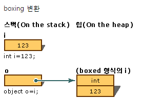
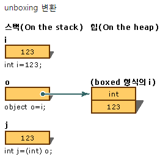

# TIL   / 2018-06-01
## Boxing & Unboxing < C# >
 

#### Boxing 
```cs
class TestBoxing
{
    static void Main()
    {
        int i = 123;
 
        // Boxing copies the value of i into object o. 
        object o = i;  
 
        // Change the value of i.
        i = 456;  
 
        // The change in i does not effect the value stored in o.
        System.Console.WriteLine("The value-type value = {0}", i);
        System.Console.WriteLine("The object-type value = {0}", o);
    }
}
/* Output:
    The value-type value = 456
    The object-type value = 123
*/
출처: http://kimjh0727.tistory.com/entry/C-Boxing과-Unboxing의-고찰 [Open-Closed Principle]
```


```cs
int num1 = 123;  
object obj = num1;      // boxing  
int num2 = (int)obj;    // unboxing  
```

object 형태의 리스트 에서 int 형 변수를 넣으면 ``AutoBoxing`` 이 되어서 object 형태로 형변환이 됨.

C# 에서 Int32 와 같은 묶어놓은 구조체를 박싱이라고 함.




박싱은 자료형을  오브젝트를 상속 받아서 쓰는것이고 오브젝트 형으로 만드는것이 박싱이고,  (값 형식 -> 참조 형식)




언박싱은 오브젝트 형을 다른 자료형으로 만드는것을 언 박싱이라고 한다. (참조 형식 -> 값 형식)

값 형식은 스택 메모리에, 참조 형식은 힙 메모리 영역에 저장되며  박싱/언박싱은 성능에 좋지않다.

MSDN 에 따르면,

```
System.Collections.ArrayList 같은 제네릭이 아닌 컬렉션 클래스의 예와 같이 많은 수의 boxing이 필요한 경우에는 값 형식을 사용하지 않는 것이 좋습니다. System.Collections.Generic.List 같은 제네릭 컬렉션을 사용하면 값 형식의 boxing을 방지할 수 있습니다. boxing 및 unboxing 과정에는 많은 처리 작업이 필요합니다. 값 형식을 boxing할 때는 완전히 새로운 개체가 만들어져야 하며, 이러한 작업은 간단한 참조 할당보다 최대 20배의 시간이 걸립니다. unboxing을 할 때는 캐스팅 과정에 할당 작업보다 4배의 시간이 걸릴 수 있습니다.

```


