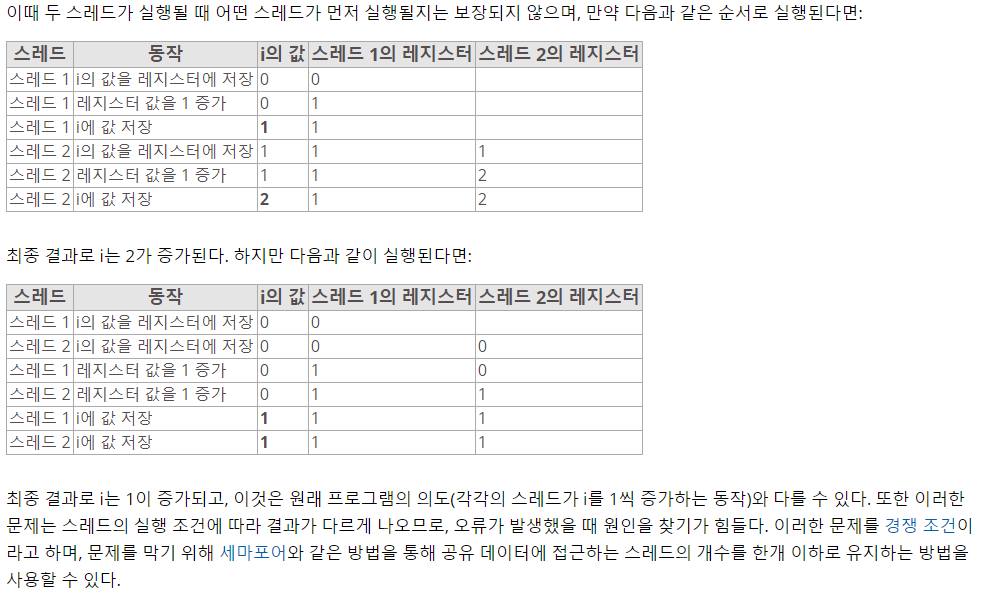

<!-- START doctoc generated TOC please keep comment here to allow auto update -->
<!-- DON'T EDIT THIS SECTION, INSTEAD RE-RUN doctoc TO UPDATE -->


- [TIL   / 2018-06-01](#til----2018-06-01)
    - [클라이언트와 서버](#%ED%81%B4%EB%9D%BC%EC%9D%B4%EC%96%B8%ED%8A%B8%EC%99%80-%EC%84%9C%EB%B2%84)
    - [쓰레드에 대하여](#%EC%93%B0%EB%A0%88%EB%93%9C%EC%97%90-%EB%8C%80%ED%95%98%EC%97%AC)
    - [Multi-Threading](#multi-threading)
      - [장점](#%EC%9E%A5%EC%A0%90)
      - [단점](#%EB%8B%A8%EC%A0%90)
    - [Invoke](#invoke)

<!-- END doctoc generated TOC please keep comment here to allow auto update -->

# TIL   / 2018-06-01
    ## Client&WebSever < C# >
 
- 하나만 사용되는 객체를 만들때, 프로그램상 동일한 커넥션 객체를 만들때,
- 유니티에서는 씬에 게임매니져와 같은 객체 생성후 DontDestroyOnLoad 를 호출, 씬 변경시에도 디스트로이를 막아주는 형태로 구현할수도 있음
- 커플링이 되어 복잡도가 올라갈수도 있다.

### 클라이언트와 서버
> 인스턴스를 불러오는 형식, instance 를 호출시..메모리관리에 나쁘다 라는 말이 있으나 아직 정보를 찾지 못함(추가바람)

```
public class test : MonoBehaviour {
    public test instance
    {
        get
        {
            if(_instance == null)
            {
                _instance = new test();
            }
            return  _instance;
        }
        set
        {
            _instance = value;
            Number = 1;
        }
    }
    private test _instance = null;


```

### 쓰레드에 대하여
 >Thread 란 어떠한 프로그램 내에서, 특히 프로세스 내에서 실행되는 흐름의 단위를 말한다.

  일반적으로 한 프로그램은 하나의 스레드를 가지고 있지만, 프로그램 환경에 따라 둘 이상의 스레드를 동시에 실행할수 있다. 이러한 실행방식을 Multi-Threading 라고 한다.

 Multi-processor System 은 Multi-Threading 과 같이 여러 흐름이 동시에 진행되지만, 멀티프로세서에서의 각 프로세스는 독립적으로 실행되고, 각각 별개의 메모리를 차지하고있다. 여러개의 프로그램들을 병렬로 처리할수 있으며, 여러개의 완전한 처리장치들을 포함한다.

### Multi-Threading
>멀티쓰레드는 하나의 코어에 대한 이용성을 증가하는것에 초점을 두고 있다.

#### 장점

1. 응답성
대화형 프로그램을 멀티쓰레드화 하면 , 프로그램의 일부분이 중단되거나, 긴 작업을 수행하더라도 프로그램의 수행이 계속되어 응답성이 증가한다.
예를 들어 멀티스레드가 적용된 웹 브라우저에서 하나의 스레드가 이미지파일을 로드하는 동안, 다른 쓰레드는 사용자와의 상호 작용이 가능하다.

2. 자원공유
스레드는 자동적으로 그들이 속한 프로세스의 자원들과 메모리를 공유한다. 코드 공유의 이점은, 한 응용 프로그램이 같은 주소 공간내에 여러개의 다른 활동성 스레드를 가질 수 있다는 점이다.

3. 경제성
프로세스 생성에 메모리와 자원을 할당하는 것은 비용이 많이 든다. 스레드는 자신이 속한 프로세스의 자원들을 공유 하기 때문에 스레드를 생성하고 문맥교환을 하는 편이 보다 경제적이다.

4. 멀티프로세서 활용
멀티 프로세서 구조에서는 각각의 스레드가 다른 프로세서에 병렬로 수행될수 있다. 단일 프로세스는 CPU가 많아도 CPU 한개에서만 실행된다.

#### 단점

1. 다중 스레드는 캐시나 [변환색인버퍼](https://www.wikiwand.com/ko/%EB%B3%80%ED%99%98_%EC%83%89%EC%9D%B8_%EB%B2%84%ED%8D%BC) 와 같은 하드웨어 리소스를 공유할때 서로를 간섭할수있다.
2. 하나의 스레드만 실행중인 경우에는 싱글 스레드의 실행시간이 개선되지 않고, 오히려 지연될수 있다.
3. 스레드 스케줄링은 멀티스레딩의 주요 문제이기도 하다.(어느 스레드가 먼저 실행되는지 알수없다.)



### Invoke

> 유니티내에서 게임 매니져를 만들어주고,  다른씬에서도 삭제되지않고 사용가능하도록 만든것, (사용해봐야함)

```
using UnityEngine;
using System.Collections;

public class GameManagerExample : MonoBehaviour
{
    private static GameManagerExample instance = null;
    private void Awake()
    {
        if (instance == null)
            instance = this;
        else if (instance != this)
        {
            Destroy(gameObject);
        }

        DontDestroyOnLoad(gameObject);

        InitGame();
    }
    public void InitGame()
    {

    }
}
```
