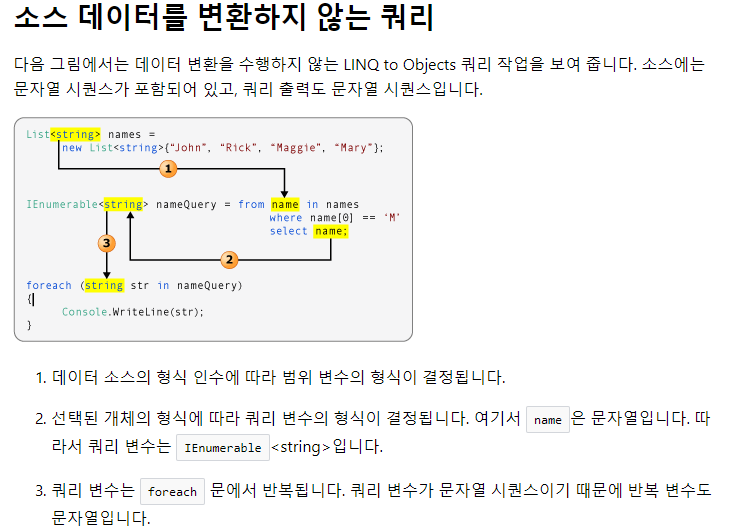

# TIL   / 2018-08-13

  # LINQ - Language-Intergrated Query < C# >

<br>

>## LINQ?

+ C#언어의 통합 질의 언어라고 한다.
+ 기존의 Query 는 데이터베이스의 데이터를 다루기 위한 언어이다.
+ 반면, LINQ는 모든 데이터에 대해 질의를 할수있는 기술이라고 한다. 
+ 컬렉션 형태를 띄는 모든 데이터에 질의를 할수 있다.
+ 복잡한 구문을 간단하게 필터링 하거나 정렬 할수 있다.
+ Extension Method, Anonymous Type, var 키워드, Lambda 식, Query 문법이 있다.

<br>

>## Query?
+ 정보 수집에 대한 요청에 쓰이는 컴퓨터 언어

<br>

>## 예제

```csharp
// 짝수 를 검사, 짝수면 리스트에 추가, 홀수면 넘어감, 
List<int> intList = new List<int>();
int[] numbers = { 1, 4, 6, 9, 8, 12, 18, 17, 11, 22 };
 
foreach (int num in numbers)
{
    if (num % 2 == 0)
        intList.Add(num);
}
intList.Sort();
 
foreach (int num in intList)
    Console.Write("{0} ", num);

// 결과
4 6 8 12 18 22
```

> 위와 같은 코드를 LINQ를 사용한다면

```csharp
 int[] number = { 1, 3, 4, 6, 5, 9, 8, 12, 15, 18, 17, 11, 22 };

 var data = from num in nunmbers
            where num % 2 == 0
            orderby num
            select num;

foreach (var i in data)
{
    Console.Write(Console.Write("{0} ", i);
}

// 결과
4 6 8 12 18 22
```
> 위와 같이 간단하게 만들수 있다.


>## var 키워드
+ 인터프리터언어(javaScript)에서 사용 하는 형식이 정해지지 않은 임의의 변수
+ c#의 var 타입은 컴파일때 타입이 결정된다! (기존은 런타임때)
+ 따라서 var가 많을수록 컴파일 타임도 늘어난다.
+ 초기값을 할당해주지 않으면 어떤 타입인지 알수없어서 초기 할당이 중요하다. 

<br>

>## from  키워드
>### (from 범위변수 in 데이터 원본)
+ 모든 쿼리식이 from 으로 시작됨. 
+ 이때 범위변수는 데이터를 저장하지 않는다. 
+ 데이터 원본은 iEnumerable, iEnumerable<T> 인터페이스를 상속 하거나, IQueryable<T> 와 같은 파생 인터페이스를 지원하는 형식이어야 한다.

<br>

>## where  키워드
>### (where 조건식)
+ 필터와 같은 역할이며, 데이터 원본으로 부터 순차적으로 가져온다.
+ 참이면 요소를 반환, 거짓이면 반환하지 않는다.
+ 여러개 사용 가능하다.

<br>

>## orderby 키워드
>### (orderby 범위변수 descending / ascending)
+ 정렬. 오름차순은 ascending 내림차순은 descending
+ defalut 는 오름차순으로 되어있다.

<br>

>## select 키워드
>### (select 범위범수)
+ 최종 결과를 산출
+ 끝은 반드시 select 혹은 group 절로 끝난다.

<br>

>## group 키워드
>### (group 범위범수 by 분류기준)  /  (group 범위범수 by 분류기준 into 그룹 변수)

+ 그룹화하여 그룹개체를 반환.
+ into 키워드는 추가적인 쿼리작업 수행을 위함

``` csharp
// 이름과 평균점수를 가진 student 타입 List
List<student> listStudent = new List<student>
{
    new Student() { Name = "김철수", Average = 78.5 },
    new Student() { Name = "김영희", Average = 91.2 },
    new Student() { Name = "홍길동", Average = 77.3 },
    new Student() { Name = "김길수", Average = 80.8 }
};
 
// listStudent 안에 student 범위변수
// 범위변수가 가진 Average 키
// Average 가 80 보다 작으면?
var queryStudent = from student in listStudent
                    orderby student.Average
                    group student by student.Average < 80.0;
 
//참인지 거짓인지에 따라 구별함 
foreach (var studentGroup in queryStudent)
{
    Console.WriteLine(studentGroup.Key ? "평균 80점 미만:" : "평균 80점 이상:");
 
    foreach (var student in studentGroup)
        Console.WriteLine("\t{0}: {1}점", student.Name, student.Average);

//결과
///평균 80점 미만:
//        홍길동: 77.3점
//        김철수: 78.5점
//평균 80점 이상:
//        김길수: 80.8점
//        김영희: 91.2점

//출처: http://blog.eairship.kr/262?category=442691 [누구나가 다 이해할 수 있는 프로그래밍 첫걸음]
```

<br>

> 이번에는  그룹변수에 따라 구분해보자
```csharp
List<Student> listStudent = new List<Student>
{
    new Student() { Name = "김철수", Average = 78.5 },
    new Student() { Name = "김영희", Average = 91.2 },
    new Student() { Name = "홍길동", Average = 77.3 },
    new Student() { Name = "김길수", Average = 80.8 },
    new Student() { Name = "김영순", Average = 54.2 },
    new Student() { Name = "김상수", Average = 90.8 },
    new Student() { Name = "이한수", Average = 61.4 }
};

// Average 키를 정수로 캐스팅, 10으로 나눈것을 그룹변수 g에 담음
// g 키를 오름차순으로 정렬
// g 를 최종결과로
// 결과는 5,6,7,8,9..
var queryStudent = from stu in listStudent
                   group stu by (int)stu.Average / 10 
                   into g
                   orderby g.Key
                   select g;
 
// 결과값 * 10
foreach (var stuGroup in queryStudent)
{
    int temp = stuGroup.Key * 10;
    Console.WriteLine("{0}점과 {1}점의 사이:", temp, temp + 10);
 
    foreach (var student in stuGroup)
        Console.WriteLine("\t{0}: {1}점", student.Name, student.Average);
}
//결과:
//50점과 60점의 사이:
//        김영순: 54.2점
//60점과 70점의 사이:
//        이한수: 61.4점
//70점과 80점의 사이:
//        김철수: 78.5점
//        홍길동: 77.3점
//80점과 90점의 사이:
//        김길수: 80.8점
//90점과 100점의 사이:
//        김영희: 91.2점
//        김상수: 90.8점

///출처: http://blog.eairship.kr/262?category=442691 [누구나가 다 이해할 수 있는 프로그래밍 첫걸음]
```

<br>

>## 데이터 변환을 수행하지 않는 LINQ to Objects

> #####  출처 https://docs.microsoft.com/ko-kr/dotnet/csharp/programming-guide/concepts/linq/type-relationships-in-linq-query-operations


 >## 소스 데이터를 변환하는 쿼리


.png)

##### 출처 및 참고 (http://taeyo.net/Columns/View.aspx?SEQ=207&PSEQ=31&IDX=3)
#####  출처 및 참고 (http://blog.eairship.kr/262?category=442691)