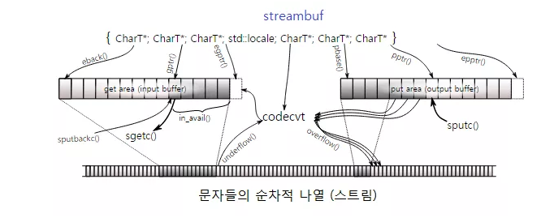

# C++ 에서의 입출력


1. 모든 입출력 클래스는 ios_base 를 부모클래스로 한다.
2. `ios_base` 클래스는 스트림의 입출력 형식 관련 데이터를 처리한다. (실수형의 정밀도, 정수형 10진수 or 16진수)
3. `ios` 클래스는 스트림 버퍼를 초기화. 입출력작업의 상태를 처리한다.(eof, fail, good 함수)
4. 스트림 버퍼는 데이터를 입출력하기전에 임시로 저장하는 곳이다.
5. 한꺼번에 읽어서 스트림버퍼에 넣고 1바이트씩 꺼내고 다시 읽는다.
6. `istream` 클래스는  입력을 수행하는 클래스 이며, 연산자 정의와 cin 이 정의되어있다.
7. 연산자 '>>' 는 모든 공백문자(띄어쓰기, 탭, 엔터)를 입력시에 무시해 버린다. 또한 호출한 자신을 리턴한다.
8. 또한 변수 타입값과 다른 리터럴을 넣으면 fail 비트를 켜고, 입력값을 받지않고 리턴해 버린다.

```cpp
// 8번의 예제
#include <iostream>
usingnamespace std;
int main() {
  int t;
  while (true) {
    cin >> t;
    cout << "입력 :: " << t << endl;
    if (t == 0) break;
  }
}
// 글자 'c' 를 넣었을때 결과
// 입력 :: -858993460 
//.. 무한 루프
```

9. ios 클래스에는 스트림의 상태를 관리하는 플래그가 4개 정의되어 있으며, 각각의 비트에 따라 상태를 알수있다.
10. `goodbit` 는 스트림에 입출력 작업이 가능할때이다.
11. `badbit` 는 복구 불가능한 오류가 발생할때이다
12. `failbit` 스트림에 복구 가능한 오류가 발생할때이다
13. `eofbit` 입력작업시 EOF (end of file) 도달시이다.
14. 예제의 경우에는 `failbit` 가 켜지고, 입력을 받지 않고 리턴하고, 버퍼에 남아있는 'c\n' 을 계속 읽어 무한루프가 진행된다.

```cpp
// 해결 방안
#include <iostream>
#include <string>
using namespace std;
int main() {
  int t;
  while (cin >> t) {
    cout << "입력 :: " << t << endl;
    if (t == 0) break;
  }
}
```
15. `ios` 클래스에는 아래와 같은 함수가 정의되어있다.

```cpp
operator void*() const;
```

16. ios 객체를 void* 타입으로 변환해주는 함수이며, 이때, null 포인터가 아닌 값을 리턴 하는 조건은 `failbit` 와 `badbit` 가 모두 0 일때이다.
17. 만약 위코드에서 문자 's' 를 입력 하면, 연산자 '>>' 는  `failbit` 를 켜게 되고, '>>' 는 cin 을 리턴, 리턴값은 while 조건식에 들어가서 타입 변환(bool) 을 하게됨 
18. ios 객체 -> void*(예제기준으로는 null) -> bool = false
19. 하지만 다시 입력을 하려면 버퍼에 있는 잘못 들어간 글자와  상태플래그를 초기화 해야한다.
20. `cin.clear()` 를 파라미터 없이 쓰면 플래그 초기화 (goodbit)가 된다.
21. `cin.ignore(최대 100자, 무시조건기준문자)` 를 쓰면 버퍼에서 무시하게 된다.

```cpp
#include <iostream>
#include <string>
using namespace std;
int main() {
  int t;
  while (true) {
    cin >> t;
    cout << "입력 :: " << t << endl;
    if (cin.fail()) {
      cout << "제대로 입력해주세요" << endl;
      cin.clear();            // 플래그들을 초기화 하고
      cin.ignore(100, '\n');  // 개행문자가 나올 때 까지 무시한다
    }
    if (t == 0) break;
  }
}
```

     
22.   `cin.fail()` 은 비트
23.   `ios_base` 클래스에서는 스트림의 입출력 
24.  `cin.setf(ios_base::hex, ios_base::basefield)` 는 입력을 **16진수**를 **기본값**으로 받는다. 
25.  `cin >> hex >> 변수 ` 를 써도 16진수로 받을 수 있다.
26.  25의 `hex` 는 조작자(함수) 이며, ios_base::hex 와 다르다.
27.  조작자 `hex` 는 `ios` 에 정의된 함수이며. `ios_base` 객체를 레퍼런스로 받고, 다시 그 객체를 리턴하도록 정의되어 있다.

```cpp
std::ios_base& hex(std::ios_base& str);
```
27.  `ios_base::hex` 는 상수 값이다.
28. 이외에도 조작자는 `boolalpha`, `left`, `right`, `dec`, `oct`, `scientific`, `endl` 등 여러가지 있다.
29. `endl` 은 `ostream` 이라는 출력을 관장하는 클래스에 정의되어 있으며, 개행문자 출력및 버퍼를 비운다 `(flush)`.
30. `flush` 는 버퍼에 데이터가 얼마나 쌓여있든간 바로 출력을 해주는 함수이다.
31. 모든 입출력 객체들은 이에 대응되는 스트림 객체를 가진다
32. C++ 의 입출력 라이브러리에는 `streambuf` 클래스가 있다.

 
   
33. 스트림버퍼 클래스는 그림과 같이 맨 아래에 나타나있는 스트림에서 입력을 받거나, 출력을 하거나, 입출력을 동시에 수행한다.
34. `streambuf` 클래스는 스트림의 상태를 나타내기 위해 세 개의 포인터를 정의하고 있다.
35. 시작포인터, 스트림 위치지정자 (다음으로 읽을 문자를 가리키고 있는 포인터), 끝 포인터가 있다.
36. `streambuf` 클래스 는 입력 버퍼와 출력 버퍼를 구분해서 각각 `getarea` `putarea` 라고 부르며, 각각의 포인터도 `g` 와 `p`를 붙여서 표현한다.

 ```cpp
#include <iostream>
#include <string>
using namespace std;

int main() {
  string s;
  cin >> s;

  // 위치 지정자를 한 칸 옮기고, 그 다음 문자를 훔쳐본다 (이 때는 움직이지 않음)
  char peek = cin.rdbuf()->snextc();
  if (cin.fail()) cout << "Failed";
  cout << "두 번째 단어 맨 앞글자 : " << peek << endl;
  cin >> s;
  cout << "다시 읽으면 : " << s << endl;
}

// 결과
// 입력 : hello world
// 맨 앞글자 : w
// 다시 읽으면 world
 ```

```cpp
char peek = cin.rdbuf()->snextc();
```

37. `cin.rdbuf` 는 cin 객체가 입력을 수행하고 있던 streambuf 객체를 가리키는 포인터를 리턴한다.
38. 이때, cin 객체는 입력인 `istream` 객체이고, 즉 이 `streambuf` 객체에는 `getarea`만 가지고 있다.
39. `snextc()` 함수는 **스트림 위치 지정자** 를 한칸 전지 시킨후 그 자리에 해당하는 문자를 엿본다.
40. 이때 엿보기와 읽기 의 차이는 보통 `streambuf` 객체에서 읽게되면 스트림 위치 지정자를 한 칸 전진시켜서 다음 읽기 때 다음 문자를 읽도록 준비해두는데, 엿보기는 **스트림 위치 지정자** 를 움직이지 않는것이다.


41. hello world 를 친 다음, cin >> s 로 넘어갔을때 `streambuf` 의 상태 
42. 이때 공백 문자가 나오기 전까지 읽어들임을 유의하자.


43. `snextc` 함수가 스트림 위치 지정자를 한 칸 전진 시키면, 이때 공백 문자를 띄어넘고 `w` 를 가르키며, `w`를 리턴
44. 이때 `snextc` 는 스트림 위치 지정자를 건드리지 않으므로 world 가 나옴
45. **C++ 입출력 라이브러리는 스트림 버퍼도 추상화하여 클래스로 만듬**
46. `streambuf`를 도입한 이유 중 한가지는 `wchar_t` 와 같은 다중 바이트 문자에 대한 처리도 용이하게 하기 위해서이다.


47. [글과 그림의 출처](https://modoocode.com/)