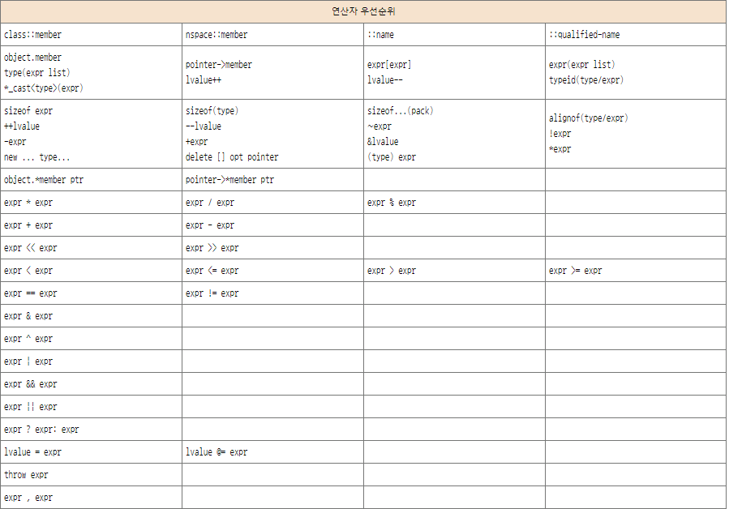

# 연산자

C++ 은 내장 연산자를 가지고 있다.

1. 계산 연산자

    1.1 산술 연산자

    1.2 불 연산자 

    1.2.1 비교 연산자

    1.2.2 논리 연산자
    
    1.3 비트 연산자
2. 할당 연산자
3. 프로그램 흐름 연산자

4. 메모리 처리 연산자
5. 접근 연산자
6. 타입 처리 연산자
7. 오류 처리 연산자

____

> ### 1.1 산술 연산자

 1. 증감 연산자 

    **값을 1증가 혹은 감소 시킨다. 변수의 값만 변하고, 임시결과의 값을 변하지 않는다.**

    <br>

    ```cpp
    int i  = 3;
    i ++;   // i = 4;
    const int j = 3;
    j++; // 컴파일 에러! 상수.
    (3 + 5)++; // 3 + 5 는 변수가 아님
    ```

    즉, 위 증감 연산자는 주소를 지정할 수 있는 무언가가 필요하다. 

    주소를 지정 할수 있는 항목을 `Lvalue` 라고 하며, 위 코드에서는 변수 i 만 Lvalue 이다. 

    변수 j 는 상수이고, 3 + 5 는 주소 지정이 불가능한 임시값이다.

    **접두사 에 있는 경우 수정된 값을 반환, 접미사에 있는경후 기존값을 반환한다.**
    
    <br>
    
    ```cpp
    int  i = 3, j = 3;
    int k = ++i + 4; // i = 4, k = 8 
    int l = j++ + 4; // j = 4, l = 7
    ```

    일반적으로 수식에서 증각나 감소의 사용를 자제하고  j + 1 등 으로 대체하거나, 증감을 분리해서 수행 하는게 좋다.

    수식이 사이드 이펙트를 갖지 않아야 읽는 사람들이 이해하기 쉽고, 컴파일러가 최적화 하기도 쉽다.

<br>

 2. 단항 연산자

    단항뺄셈은 숫자의 값을 양수면 음수로, 음수면 양수로 바꾼다.

    ```cpp
    int i = 3;
    int k = -1; // j는 -1
    ```

    ' * ' 연산자와 / 연산자는 모든 숫자 타입에 정의 되어 있으며, 곱셈과 나눗셈을 수행한다.


    % 연산자는 정수 나눗셈의 나머지를 산출한다. 


    결과의 소수부분을 버리는 방법이나 오버플로를 처리하는 방법은, C++ 기준 성능상의 이유로, 하드웨어 업체에 맡긴다.

    **곱셈과 나눗셈은 덧셈과 뺄셈 보다 먼저 계산 하고, 연산은 왼쪽에서 오른쪽 순서로 결합한다.**

    ```cpp
    x - y + z  = (x - y) +z
    ```

    아래 예제에서 결합성에 따라 첫번째 덧셈이 두번째 덧셈 보다 먼저 수행됨을 보장한다.

    그러나, f(++i) 와 g(++i) 중 어느 표현식이 먼저 계산 될 것인지는 컴파일러 구현에 따라 달라진다.

    차라리 몇자 분리하는게 시간을 더 아낄수 있는 방법 이기도 하다.
    ```cpp
    int i = 3, j = 7, k;
    k = f(++i) + g(++i) + j;
    ```

    위 연산자들을 사용한 숫자 프로그램 예제를 보다

    ```cpp
    #include <iostream>

    int main()
    {
        const float r1 = 3.5, r2 = 7.3, pi = 3.14159;
        float area1 = pi * r1 * r1;

        std::cout << " A Circle of radius " << r1 << "has area" 
                  << area1 << "." << std::endl;

        std::cout << "The average of" << r1 << "and" << r2 << "is "
                  << (r1 + r2) / 2 << "." << std::endl;
        return 0;
    }
    ```

    **이항 연산의 두인수가 서로 다른 타입을 가질때 하나의 인수 또는 두 인수 모두 변환 규칙에 따라 강제 변환된다.**
___
[변환 규칙]
___

변환은 정밀도의 손실을 초래 할수 있다. 부동 소수점 수를 정수보다 우선시 한다. 

64비트 long 타입 -> 32 flaot 타입으로 변환은 정확도 손실을 초래한다.

심지어 32비트 int 라도 32비트 float 으로 정확하게 표현할수 없다.

왜냐하면 int 의 일부 비트를 지수 비트로 사용해야 하기 때문이다. 

또한 저장 할 변수는 정확한 결과를 저장할 수 있지만, 계산 중간에 이미 정확도가 손실된 경우도 있다.

예를 들면

```cpp
    long l = 123456789012;
    long l2 = l + 1.0f + 1.0; // 부정확함 (long + float + double)
    long l3 = l + (1.0f - 1.0); // 정확함
```

<br>

**l2 = 1234567954431
l3 = 1234567890123**
<br>

l2 의 경우 중간 변환으로 인해 정확도를 잃는다. 반면에 l3 는 정확하게 계산한다.

<br>

> ### 2. 불 연산자

1. 불 연산자
    **논리 연산자와 관계 연산자가 있으며, bool 값을 반환한다.**

    __________________
    **우선순위**
    1. !a
    2. a > b  ,  a >=b
    3. a < b  ,  a <=b
    4. a == b ,  a !=b   
    5. a && b , a || b
    __________________

    이진 관계, 이진 논리 연산자 보다 산술 연산자를 먼저 처리한다.

    이는 4 >= 1+7 과 같은 표현식을 4 >= (1 + 7)로 처리 한다는 것을 의미한다.

    **반대로 논리 부정을 의미하는 단항연산자 ! 는 모든 이항 연산자 보다 우선순위가 높다**

    비교는 아래 예제와 같이 연결해서 사용할수 없다

    ```cpp
    bool in_bound = min <= x <=y <= max ; // 컴파일 에러!
    ```
    
    대신 아래와 같이 풀어서 하나씩 사용해야 한다.

    ```cpp
    bool in_bound = min <= x && x <= y && y <= max;
    ``` 

2. 비트 연산자

    정수 타입의 단일 비트를 검사하거나, 조작할 수 있게 해준다.

     __________________
    **우선순위**
    1. ~x
    2. x << y
    3. x >> y
    4. x & y 
    5. x | y
    6. x ^ y
    __________________

    2,3 과 같은 시프트 는 이동한 만큼 비게 된 공간은 0 으로 채워진다.

    단, 음수값의 비트를 오른쪽으로 이동하는 경우 1로 채워진다.

    AND 는 두항의 각 비트가 모두 1 일때만 1을 반환 합니다.

    OR 은 두항의 각비트가 하나라도 1이면 1을 반환 합니다.

    XOR 은 두항 의 비트가 하나라도 1이면 1을 반환하되, 두항 모두 1이면 0을 반환합니다.

3. 할당 연산자

    개체 (수정 가능한 Lvalue) 의 값은 할당 연산자를 통해 설정 할수 있다.

    ```cpp
    object = expr;
    ```

    object 와 expr 타입이 다를때, 가능하다면 Rvalue 의 타입을 Lvalue 의 타입으로 변환 한다.
    
    ```cpp 
    o3 = o2 = o1 = expr;
    ```

    할당 연산자는 오른쪽에서 왼쪽순서로 결합하기 때문에 하나의 표현식으로 여러 개체에 값을 연속적으로 할당할 수 있다.

    합성 할당 연산자 들은 오른 쪽에 있는 인수로 왼쪽에 있는 개체에 산술 연산이 나 비트 연산을 적용한다. 

    예를 들어 아래 예제는 같은 작업을 수행한다.

    ```cpp
    a += b;
    a = a + b;
    ```

    모든 할당 연산자는 모든 산술 연산자 또는 모든 비트 연산자 보다 더 낮은 우선 순위를 가지므로 오른쪽에 있는 표현식은 항상 합성 할당 연산자를 수행하기 전에 먼저 계산한다.
    
    ```cpp
    a *= b +c;
    a = a * (b + c)l
    ```
  
> ### 프로그램 흐름

프로그램 흐름을 제어하는 연산자는 세가지다. 

함수 호출은 연산자 처럼 처리한다. [함수]

조건 연산자  c ? x : y;

**콤마 연산자** 순차적인 계산을 제공하는 특별 한 연산자이다.

콤마의 왼쪽에 있는 하위 표현식을 먼저 계산한뒤 오른쪽에 있는 하위 표현식을 계산하는 것이다. 

표현식 전체의 값은 오른쪽 하위 표현식의 값이다.

```
3 + 4 , 7 * 9.3  // 65.1
```

콤마 표현식을 함수의 인수로 사용할 때는 괄호로 둘러 싸야한다. 아니면 콤마를 한수 인자들을 분리한다고 해석한다.

> ### 메모리 처리

new 연산자와 delete 연산자 는 각각 메모리를 할당하고 해제하는 연산자다 [메모리처리]

> ### 접근 연산자

하위 구조 접근, 참조(변수의 주소를 가져옴), 간접참조( 주소를 통해 참조된 메모리에 접근)를 위한 여러가지 연산자 들을 제공한다. [포인터와클래스]

> ### 타입 처리

타입을 다루는 연산자들은 컴파일 타임 프로그램을 작성할 때 소개 할것이다. [타입처리]

> ### 오류처리 

thorw 연산자는 실행시 예외를 나타내는데 사용한다 [오류처리]

> ### 오버로딩

연산자들을 새롭게 정의함. 내장 타입들의 연산자는 변경할수 없지만, 어떻게 상호작용 할지 정의 할수 는 있다. 

단, 아래의 연산자들은 오버로딩 할수없다

1. :: 스코프지정 
2. *. 포인터를 통한 멤버선택
3. ?: 조건부
4. sizeof 타입이나 오브젝트의 크기
5. sizeif... 인수의 갯수 
6. alignof 타입이나 오브젝트의 메모리 맞춤
7. typeof 타입 식별자

> ### 연산자 우선순위



