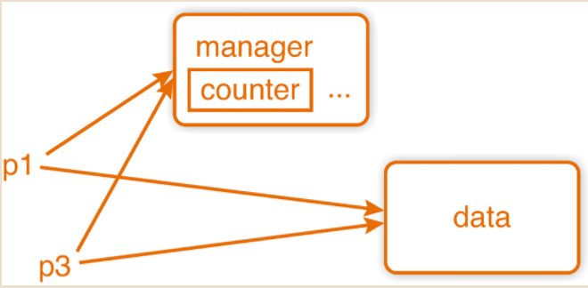
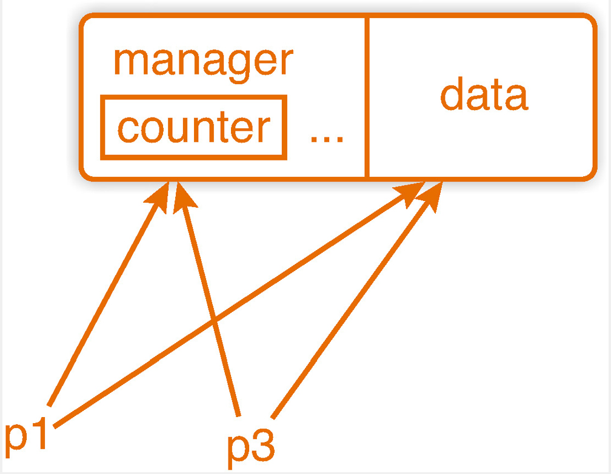

<!-- START doctoc generated TOC please keep comment here to allow auto update -->
<!-- DON'T EDIT THIS SECTION, INSTEAD RE-RUN doctoc TO UPDATE -->


- [Array & Pointer](#array--pointer)
  - [[Deleter]:(https://en.cppreference.com/w/cpp/memory/unique_ptr)](#deleterhttpsencppreferencecomwcppmemoryunique_ptr)

<!-- END doctoc generated TOC please keep comment here to allow auto update -->

# Array & Pointer

> ### 배열

C++ 에서 지원하는 배열에는 특정 제한 사항과 이상한 동작이 있다. 하지만 우리는 모든 C++ 프로그래머가 이러한 제한 사항과 이상한 동작을 알아야하고 그문제점을 인식해야 한다고 생각한다.

배열의 선언은 아래와 같다.
```cpp
int x[10];
```

변수 X 는 10개의 int 항목이 있는 배열이다.  배열의 크기는 일정해야 하며, 컴파일 시 알고 있어야 한다. 

일부 컴파일러 (gcc) 는 런타임 크기를 지원한다.

배열은 대괄호로 접근 한다. x[i] 는 x의 i번째 요소의 레퍼런스다.

첫번째 요소는 x[0] 이고, 마지막은 x[9] 이다. 

배열은 정의와 동시에 초기화 할수 있다.

```cpp
float v[] = {1.0, 2.0, 3.0}, w[] = {7.0, 8.0, 9.0};
```

이 경우, 배열의 크기를 추론한다.

C++ 11 의 리스트 초기화는 더 이상 축소 할수 없다. 실제로 리스트 초기화는 기존 문법과 거의 차이가 없다.

예를 들어

```cpp
int v[] = {1.0, 2.0, 3.0}; // C++11 에서 오류 : 축소 float -> int
```

이 구문은 C++03 에서는 합법적이 었지만 C++11 에서는 그렇지 않다.

왜냐하면 부동소수점 리터럴에서 int 로의 변환으로 인해 소수점 이하의 정밀도를 잃어버리기 때문이다.

배열 작업은 일반적으로 루프에서 수행한다. 

예를 들어 벡터 연산으로 x = v-3w를 계산 하는 코드는 다음과 같다.

```cpp
//벡터 연산으로 x = v-3w를 계산 하는 코드
float x[3];
for (int 1 = 0; i < 3; ++i)
{
    x[i] = x[i] - 3.0 * w[i];
}
```

더 높은 차원의 배열을 정의할수 도 있다.
```cpp
float A[7][9];
int q[3][2][3];
```

C++ 는 배열에 선형 대수 연산을 제공하지 않는다. 배열을 기반으로 하는 구현은 촌스러워 보이며 오류가 발생하기 쉽다.

예를 들어
```cpp
//벡터를 추가하는 함수
void vector_add(unsigned size, const double v1[], const double v2[], double s[])
{
    for(unsigned i = 0; i < size; ++i)
    {
        s[i] = v1[i] + v2[i];
    }
}
```

대개 변수가 배열인 경우는 크기 정보를 포함하지 않기에 배열의 크기를 함수의 첫번째 파라미터로 전달했다. 이경우 함수의 호출자는 올바른 크기를 갖는 배열을 전달해야 한다.

```cpp
int main()
{
    double x[] = {2,3,4}, y[] = {4,2,0}, sum[3];
    vector_add(3, x, y, sum);
    ...
}
```

**배열의 바이트 크기를 단일 항목의 바이트 크기로 나누면 배열의 크기를 알수 있다.**

```cpp
vector_add(sizeof x / sizeof x[0], x, y, sum);
//        바이트크기 / 단일항목의바이트크기 
```

이 구형 인터페이스를 사용하면 배열의 크기가 일치하는지 테스트 할 수 없다. 슬프게도 크기정보를 함수 인수로 전달하는 인터페이스가 있는 C및 Fortran 라이브러리를 오늘날에도 여전히 구현하고 있다.

사소한 사용자 실수로 충돌이 발생하고 충돌 원인을 추적하는 데 엄청난 노력이 필요 할수 있다.

사용자 정의 수학 소프트웨어를 만들면 사용하기 쉽고 실수를 덜 범할수 있을것이다.

> ### 배열의 두가지 단점

+ 배열에 접근하기전 인덱스를 검사하지 않아, 배열외부에 접근한다는 사실을 알게되고, 이로 인해 세그먼트오류/위반으로 프로그램에 크래시가 발생한다. <br> 하지만 이경우는 최악이 아니다. 적어도 뭔가 잘못되었다는 것을 알 수 있기 때문이다. 잘못된 접근 또한 우리의 데이터를 망칠수 잇다. 프로그램은 정상적으로 실행되지만, 예상 결과와 달리 완전히 잘못된 결과를 산출한다. 코드를 덮어 쓸수도 있다. <br>
+ 배열의 크기는 컴파일 타임에 알고 있어야 한다. 예를 들어 파일에 저장되어 있는 배열을 메모리로 다시 읽어야 한다. <br> (일부 컴파일러는 런타임 값을 배열 크기로 지원한다.) 

```cpp
ifstream ifs("some_array.dat");
ifs >> size;
float v[size]; // 컴파일 타임에 크기를 알지 못한다.
```

컴파일 하는 동안 크기를 알아야 하기 대문에 이 코드는 동작하지 않는다.

첫번째 문제는 새로운 배열 타입으로, 두번째는 동적 할당으로만 해결할수 있다.

두 문제를 해결하기 위해 포인터가 등장한다.

>### 포인터

+ 포인터의 두가지 용도
  + 개체를 참조
  + 동적 메모리를 관리함


포인터는 메모리 주소를 포함 하는 변수다. 이 주소는 주소연산자 `(&x)`  또는 동적으로 할당한 메모리로 얻을 수 있는 다른 변수의 주소일 수 있다. 

먼저 후자인 동적인 크기의 배열을 할당하는 것부터 시작해보자.

```cpp
//new 를 이용한 동적 크기 할당.
int* y = new int[10];
```
이전에 있던 벡터 읽기 예제를 구현 할 수도있다.

```cpp
ifstream ifs("some_array.dat");
int size;
ifs >> size;
float* v[] = new float[size];
for (int i = 0; i < size ++i)
    ifs >> v[i];
```

포인터는 배열과 같은 위험이 있다. 범위를 벗어난 데이터에 접근하면 **프로그램에 충돌이 발생 하거나 데이터가 무효화** 될 수 있다.  

또한 더 이상 필요하지 않을때 메모리를 해제해야 할 책임이 있다.

```cpp
delete[] v;
```

함수의 매개변수가 배열일 경우 내부적으로 포인터로 취급하기 때문에 vector_add 함수는 포인터와 함께 동작한다.

```cpp
int main()
{
	double *x = new double[3], *y = new double[3], *sum = new double[3];
	for (unsigned i = 0; i < 3; ++i)
	{
		x[i] = i + 2, y[i] = 4.2 * i;
	}
	vector_add(3, x, y, sum);
	...
}
```

포인터를 사용하면 sizeof 트릭을 사용할 수 없다. sizeof 는 단지 우리에게 포인터 바이트 크기를 제공할 것이고 따라서 요소 개수에 독립적이다. 그외 에도 대부분의 상황에서 포인터와 배열은 서로 바꿔 쓸 수있다.

포인터는(앞의 목록에서와 같이) 배열 인수와 배열을 포인터 인수로 전달할 수 있다.

**배열인수의 유일하게 다른점은 정의다**  

**크기 가 n 인 배열을 정의 하면 n 개의 항목에 대한 공간을 예약하고 포인터 를 정의하면 주소를 보유할 공간만 예약한다.**

배열 부터 시작 했기 때문에 포인터 사용과 관련해 첫 번째 단계를 살펴보기 전에 두번째 단계 부터 살펴봤다.

포인터의 간단한 사용 방법은 하나의 단일 데이터 항목을 동적으로 할당하는 방법이다.

```cpp
int* ip = new int; // <-> delete ip
```

하지만 할당과 해제의 이중성에 유의해야 한다. 딘일 개체 할당에는 단일 개체 해제가 필요하며, 배열 할당에는 배열 해제가 필요하다.

그렇지 않으면 런타임 시스템이 해제를 잘못 처리해 이 시점에서 크래시가 발생할 가능성이 크다.

포인터는 다른 변수를 참조할 수도 있다.

```cpp
// & 연산자는 개체를 가져와서 주소를 반환한다. 
int i = 3;
int* ip2 = &i;

// * 연산자는 주소를 가져와서 개체를 반환한다.
int j = *ip2;
```

이를 역참조라고 한다. 
___
**<C++11>**

초기화 하지 않은 포인터에는 무작위 값을 할당하며, 오류가 발생할수 있다.

이를 방지하기 위해서 명시적으로 알려줘야 한다.

```cpp
int* ip = nullptr;
int* ipa[] = nullptr;
```

주소값 0은 애플리케이션에서 절대 사용하지 않으므로 포인터가 비어 있다는 것을 나타내는 안전한 방법이다. 그럼에도 리터럴 0 은 의도를 명확하게 전달하지 않기 때문에 함수 오버로딩에서 모호함을 유발할 수있다.

NUll 매크로는 좋지않다.  단지 0으로 치환하기 때문이다. 
__

포인터의 가장 큰 위험은 메모리 누수 이다. 에를 들어 배열 y 가 너무 작아서 새로운 배열을 할당하고 싶다고 하자.

```cpp
int* i = new int[15];
```

이제 우리는 더 많은 공간을 할당할 수 있다. 하지만 우리가 할당했던 메모리는 여전히 있지만, 더는 접근할수 없다. 그 메모리를 해제하려면 주소가 필요하기 때문에 해제 할 수도 없다. 

미메모리는 프로그램의 나머지 부분을 실행하면서 손실된다.  프로그램이 종료된 후에만 해당 메모리를 해제할수 있다. 

[참고_메모리누수찾기]


> ### 포인터 관련 오류 최소화 하기

+ 표준 컨테이너를 사용하라. 
  + 표준 라이브러리나, 유효성이 검증된 라이브러리를 사용하라. `std::vector `는 크기 조정 및 범위 검사를 포함한 동적 배열의 모든 기능을 제공하며 메모리를 자동으로 해제한다.
+ 캡슐화
  + 클래스에서 동적 메모리관리. 
    <br> 개체를 소멸 할때 개체가 할당한 모든 메모리를 해제하면 메모리 할당 빈도는 더 이상 중요하지 않다. 만약 738개의 개체를 동적 할당했다면 738 번 해체할것이다. 
    메모리는 개체 생성시 할당하고 파괴시 해체해야 한다.
    이를 **RAII(Resource Acquisition Is Initialization)** 라고 한다. 
+ 스마트포인터를 사용하라
  


> ### **<C++11>** 스마트 포인터 

[참고글](https://stonzeteam.github.io/Unique_Ptr/)

+ unique_ptr
+ shared_ptr
+ weak_ptr
----
> ### 1. unique_ptr
____
 + 특징

1. (커스텀삭제자가 없다면) raw pointer와 똑같은 크기로 똑같은 성능과 똑같은 기능을 할 수 있으면서, 메모리 관리는 알아서 해준다.
2. std::unique_ptr은 독점적으로 소유하여 객체를 관리하는 smart pointer
3. 기본적인 메모리 해제 외에 커스텀 삭제자를 도입할 수 있다
4. std::unique_ptr을 std::shared_ptr로 손쉽게 변환할 수 있다.
___
이 포인터의 이름은 참조한 데이터의 **고유 소유권** 을 나타낸다.

기본적으로 일반 포인터와 같이 사용할 수 있다.

**가리키는 한 객체에 대해서 독점 하고 소유한다.**

해당 개체는 다른 unique_ptr 로 소유권을 이전 하지 않는 한 독점적으로 소유한다.

다른 unique_ptr 로 복사되지 않고 소유권을 옮기는 것만 가능하다. 

이것은 std::move 를 통해서 실행할 수 있다.

또한 일반 포인터로 소유권을 옮길수 없다.  크기는 일반 포인터와 같다.

```cpp
#include <memory>
#include <iostream>

using namespace std;


int main()
{
	unique_ptr<int> uip{ new int };
	*uip = 8;
}
```

원시 포인터와의 주요 차이점은 포인터가 만료되면 메모리가 자동으로 해제한다는 점이다.

따라서 동적으로 할당하지않은 주소를 할당하면 버그가 발생한다.

```cpp
double d;
unique_ptr<double> dd {&d}; // 오류: 동적할당 하지않은 주소를 할당함
```
포인터dd의 소멸자가 d를 삭제하려고 시도한다.

unique_ptr 는 다른 포인터에 타입에 할당되거나 암시적으로 변환할 수없다. 

원시 포인터에서 포인터의 데이터를 얻고 싶다면 멤버 함수 get을 사용하면 된다.

```cpp
int* raw_ip = uip.get();
```

다른 unique_ptr 에 할당 할 수도 없다.

```cpp
unique_ptr<double> uip2 {uip}; // 복사금지
uip2 = uip; // 복사금지
```

unique_ptr 은 오직 이동만 가능하다. std::move 를 사용한다.

```cpp
unique_ptr<double> uip {new int}; 
unique_ptr<double> uip2 {std::move(uip)}, uip3;
uip3 = std::move(uip2);
```

우리는 이후에 [이동문법] 을 설명 할 것이다. 지금 당장은 이렇게 이해하자

**복사는 데이터를 복제하는 반면, 이동은 원본에서 대상으로 데이터를 전송한다**

위 예서는 참조한 메모리의 소유권은 uip 에서 uip2 로 전달한다음 uip3 로 전달한다.

uip 와 uip1 은 nullptr 가 되고, uip3 의 소멸자는 메모리를 해제한다.

마찬가지로 unique_ptr를 함수에서 반환할 때 메모리의 소유권을 전달한다.

다음 예제에서 dp3는 f()에 할당한 메모리를 대신 사용한다.

```cpp
#include <memory>
#include <iostream>

using namespace std;

unique_ptr<double> f()
{
    return unique_ptr <double> {new double};
}

int main()
{
	unique_ptr <double> dp3; //이 시점에서는 nullptr;
	dp3 = f(); // double 동적할당.
}
```

이 경우 함수의 return 값은 이동될 임시 값이므로 move() 가 필요 하지않다. [이동문법]

unique_ptr 에는 배열을 위한 특별한 구현이 있다. [특수화]

이 작업은 (delete[] 와 함께) 메모리를 적절히 해제할 때 필요하다.  또한 특수화를 통해 배열처럼 요소에 접근할 수있는 기능을 제공한다.

```cpp
#include <memory>
#include <iostream>

using namespace std;

int main()
{
    unique_ptr <double[]> da { new double[3] };
    for (int i = 0; i < 3; i++)
    {
        da[i] = i + 2;
        cout << da[i] << '\n';
    }
}
```
그 대신, 연산자 * (원시포인터)는 배열에 사용할 수없다.

unique_ptr 의 중요한 이점은 원시 포인터에 비해 시간과 메모리에 대한 오버헤드가 전혀 없다는 점이다.

___
<참고> unique_ptr의 고급 기능으로 사용자 정의 [Deleter]를 제공하는 기능이 있다. 

[Deleter]:(https://en.cppreference.com/w/cpp/memory/unique_ptr)
----
> ### 2. shared_ptr

____
 + 특징

1. 하나의 특정 객체를 참조하는 스마트 포인터가 총 몇 개 인지를 참조하는 포인터.
2. 참조하고 있는 포인터의 개수를 참조횟수(reference count) 라고 함
3. 참조횟수는 특정객체에 새로운 shared_ptr 이 추가될때 1증가, 수명이 다하면 1감소
4. 참조횟수가 0이 되면 delete 키워드를 사용하여 자동으로 메모리해제.
___
shared_ptr 는 이름에서 알 수있듯이 여러 파티( 각 파티가 포인터를 갖고 있음) 에서
공통으로 사용하는 메모리를 관리한다. shared_ptr가 더 이상 데이터를 참조하지 않는 즉시 메모리를 자동으로 해제한다.

이렇게 하면 프로그램을 상당히 단순하게 만들 수 있다.

특히 복잡한 데이터 구조의 경우 더욱 그렇다. 매우 중요한 애플리케이션 영역은 바로 동시성이다. 즉 모든 스레드가 스레드에 대한 접근이 끝나면 메모리를 자동으로 해제한다.

unique_ptr과 달리 shared_ptr는 원하는 만큼 자주 복사할 수있다.

예를 들어

```cpp
#include <memory>
#include <iostream>

using namespace std;

shared_ptr <double> f()
{
    shared_ptr<double> p1{ new double };
    shared_ptr<double> p2{ new double }, p3 = p2;
    cout << "p3.use_count() = " << p3.use_count() << endl;
    return p3;
}

int main()
{
    shared_ptr<double> p = f();
    cout << " p.use_count() = " << p.use_count() << endl;
}

// 출력
// p3.use_count() = 2
// p.use_count() = 1
```

위 예제에서는 두 double 값을 저장하는 메모리 p1 과 p2 를 할당했다. 포인터 p3 는 p2 를 복사해 아래에 표시된 것처럼 메모리를 가르킨다.

 

함수가 반환하면 포인터를 파괴하고, p1이 참조하는 메모리를 (사용하지않고) 해제한다.

두번째로 할당한 메모리 블록은 main 함수의 p가 여전히 이를 참조하기 때문에 계속 존재한다.

가능하다면 make_shared 를 사용해서 shared_ptr 를 만들어야 한다.

```cpp
//전달받은 인수를 사용해 지정된 타입의 객체를 생성하고, 생성된 객체를 가르키는 포인터를 반환
shared_ptr<double> p1 = make_shared<double>();
```

이렇게 하면 아래 그림과 같이 메모리에 함께 관리 및 비즈니스 데이터를 저장하며 메모리 캐싱이 보다 효율적이다. make_shared는 shared_ptr 를 반환하기 때문에 단순화를 위해 [자동추론] 을 사용할수 있다.



```cpp
auto p1 = make_shared<double>();
```
shared_ptr에는 메모리와 실행 시간에 약간에 오버헤드가 있다. 하지만 약간의 오버레드로 프로그램을 단순화할 수있다.

----
> ### 3. weak_ptr

____
 + 특징

1. 하나 이상의 shared_ptr 인스턴스가 소유하는 객체에 대한 접근을 제공하지만, 소유자의 수에는 포함되지 않음
2. 만약 shared_ptr 이 서로를 가르키면 순환 참조가 되어 참조 횟수가 절대 0이 안됨
3. 이러한 순환 참조를 제거하기 위해 사용.
___

shared_ptr 에서 발생할 수 있는 문제는 메모리 해제를 방해하는 **순환 참조** 이다.

weak_ptr 은 공유하더라도 소유권을 주장하지 않는다. 


동적으로 메모리를 관리하기 위해 포인터 대신 사용할 수있는 수단은 없다. 

다른 개체만을 참조하고 싶다면 레퍼런스라는 기능을 사용하면 된다.

> ### 레퍼런스

```cpp
int i = 5;
int& j = i;
j = 4;
std::cout << " i is " << i << '\n';
//출력 
// 4
```

변수 j 는 i 를 참조한다. j 를 변경하면 i도 변경되고, 그 반대도 그렇다.

레퍼런스를 별칭으로 생각 할 수 있다. 기존에 있는 개체 또는 하위 개체에 새로운 이름을 도입한다.

레퍼런스를 정의할 때 마다 포인터와는 달리 어떤 변수를 참조할 것인지를 직접 선언해야한다.

나중에 다른 변수를 참조할 수는 없다.

___
**<C++11>** <br>포인터와 레퍼런스의 절충안으로 레퍼런스와 비슷하게 동작하지만 일부 제한을 피하는 [reference_wrapper] 클래스를 제공하며, 예를 들어 컨테이너 내에서 사용할수 있다.
___


> ### 포인터와 레퍼런스의 비교

레퍼런스에 비해 포인터가 갖는 주요 이점은 동적 메모리관리 및 주소 게산 기능이다. 

반면에, 레퍼런스는 기존 위치를 참조해야한다. (레퍼런스는 임의의 주소를 참조 할 수도 있지만, 하는 방법을 알려면 더 열심히 노력해야 할것이다.)

따라서 레퍼런스는 매모리 누수를 남기지 않고, 참조한 개체와 같은 표기법을 사용한다.

불행하게도 레퍼런스의 컨테이너를 만드는 건 거의 불가능 하다.

레퍼런스는 오류에 안전하지 않지만 오류 발생가능 성이 훨신 적다. 포인터는 동적 메모리를 다룰 때만 사용해야 한다.

(예를 들어 리스트 또는 트리와 같은 데이터 구조를 동적으로 만들때) 

꼼꼼하게 테스트 한 타입을 통해서만 사용하거나 가능하면 클래스 내에서 포인터를 캡슐화 해야한다. 스마트 포인터는 메모리 할당을 처리하며 클래스 내에서도 원시 포인터 보다 우선적으로 고려해야한다. 

> ### 포인터

+ 메모리관리
+ 주소게산
+ 컨테이너 만들기

> ### 레퍼런스

+ 정의된 위치 참조
+ 초기화 필수
+ 메모리 누수방지
+ 개체와 같은 표기법

> ### 오래된 데이터를 참조하지 마라

함수 내의 지역 변수는 함수 스코프 내에서만 유효하다. 

예를 들면

```cpp
double& square_ref(double d) // 이렇게 하지마라!
{
    double s = d * d;
    return s;
}
```

여기서 square_ref의 함수 결과는 더 이상 존재하지 않는 지역변수 s를 참조한다. 저장되어 있던 메모리가 아직 남아있으며, 우연히 덮어쓰지 않았을 수도 있다.

그러나 우리가 믿을 수 있는것은 아무것도 없다.  실제로 숨겨진 오류는 특정 조건에서만 프로그램에 크래시가 발생하기 때문에 명백하게 발생하는 오류보다 훨씬 좋지 않으며, 이런 경우 원인을 찾기가 매우 어렵다.

이러한 레퍼런스를 **부실 레퍼런스** 라고 한다.

포인터에도 똑같이 적용한다.

```cpp
double* square_ptr(double d)
{
    double s = d * d;
    return &s;
}
```

이 포인터는 스코프를 벗어난 지역 주소를 갖는다 이를 **댕글링 포인터**라고 한다.

멤버 데이터를 참조할 때 멤버 함수에서 레퍼런스 또는 포인터를 반환할 수있다.

[참조]

___
**<주의>**
동적으로 할당할 데이터, 함수를 호출하기 전의 데이터 또는 정적데이터에 대한 포인터 및 레퍼런스만 반환 하라.
___

> ### 배열용 컨테이너

1. 표준 벡터

배열과 포인터는 C++ 언어의 핵심 부분이다. 

std::vector 표준 라이브러리에 속하며 클래스 템플릿으로 구현한ㄷ,

그럼에도 불구하고 배열과 매우 유사하게 사용할 수 있다. 에를 들어 두 배열 v와 w 를 설정하는 [예제]를 벡터로 바꾸면 다음과 같은 코드 가 된다.

```cpp
#include <vector>

int main()
{
	std::vector<float> v(3), w(3);
	v[0] = 1; v[1] = 2; v[2] = 3;
	w[0] = 7; w[1] = 8; w[2] = 9;
}
```
벡터의 크기는 컴파일할 때 알 필요가 없다. [벡터] 존재하는 동안 크기를 조정할 수도 있다.

요소별로 값을 설정하는 방법은 그다지 좋은 방법이 아니다. C++ 11 에서는 초기화 목록을 사용해 초기화 할 수있다.

```cpp
std::vector<float> v = {1, 2, 3} w = {7, 8 ,9};
```

이 경우 벡터의 크기는 목록의 길이를 통해 구할 수 있다. 이전에 봤었던 vector_add 함수를 보다 안정적으로 구현할 수있다.

```cpp
#include <vector>
#include <assert.h>

using namespace std;

void vector_add(const vector<float>& v1, const vector<float>& v2, vector<float>& s)
{
	assert(v1.size() == v2.size());
	assert(v1.size() == s.size());

	for (unsigned i = 0; i < v1.size; ++i)
	{
		s[i] = v1[i] + v2[i];
	}
}
```

C의 배열 및 포인터와 달리 벡터 인수는 크기를 알고 있으므로 일치하는지를 확인할 수 있다.

[참고_배열의크기추론]

벡터는 복사 가능하며 함수를 통해 반환할 수도 있다. 이렇게 하면 보다 자연스러운 표기법을 사용할 수 있다.

```cpp
#include <vector>
#include <assert.h>

using namespace std;

vector<float> add(const vector<float>& v1, const vector<float>& v2)
{
	assert(v1.size() == v2.size());
	vector<float> s(v1.size());
	for (unsigned i = 0; i < v1.size(); i++)
	{
		s[i] = v1[i] + v2[i];     
		return s;
	}
}

int main()
{
	std::vector<float> v = { 1, 2, 3 }, w = { 7, 8, 9 }, s = add(v, w);	
}
```

이 구현은 대상 벡터를 레퍼런스로 전달하는 이전 코드보다는 비용이 잠재적으로 더 비사다. 나중에 컴파일러와 사용자 측면 모두에서 최적화할 수있는 가능성에 대해 논의 할것이다.

우리의 경험으로 따르면 생산성 있는 인터페이스로 시작한 뒤 나중에 성능을 다루는게 더 중요하다.

실행속도가 빠른 프로그램을 올바르게 수정하는 것보다 올바른 프로그램을 빠르게 만드는게 더쉽다.

std::vector 컨테이너는 수학적 의미의 벡터가 아니다. std::vector에는 산술 연산이 없다.
그런데도 컨테이너는 스칼라가 아닌 중간 결과를 처리하기 위한 과학적 애플리케이션에서 매우 유용하다는 사실이 입증되었다.

2. valarray

**valarray 는 요소별 연산을 사용하는 1차원 배열이다.**
 곱셈도 요소 단위로 수행한다. 스칼라 값을 사용한 연산은  valarray 의 각 요소와 함께 수행한다. 따라서 부동소수점 숫자의 valarray는 벡터 공간이다.

```cpp
#include <iostream>
#include <valarray>

int main()
{
	std::valarray<float> v = { 1, 2, 3 }, w = { 7, 8 , 9 }, s = v + 2.0f * w;
	v = sin(s);
	for (float x : v)
	{
		std::cout << x << '  ';
	}
	std::cout << '\n';
}
```

`valarray<float>` 는 자체적인 타입 또는 float 로만 동작할수 있다.

예를 들어 2 * w 는 valarray<float> 과 int 의 지원하지 않는 곱셈 연산이므로 컴파일 오류가 발생한다.

valarray 의 강점은 슬라이스에 접근하는 기능이다. 각각의 연산을 포함해 행렬과 고차 텐서를 대리 실행할 수있다. 

그럼에도 불구하고 대부분의 선형대수 연산을 직접지원하지 않기 때문에 수치를 다루는 커뮤니티에서 valaary를 널리 사용하지 않는다. 또한 선형대수학을 위해 확립된 C++ 라이브러리를 사용하는게 좋다. 

[가비지콜렉션] 