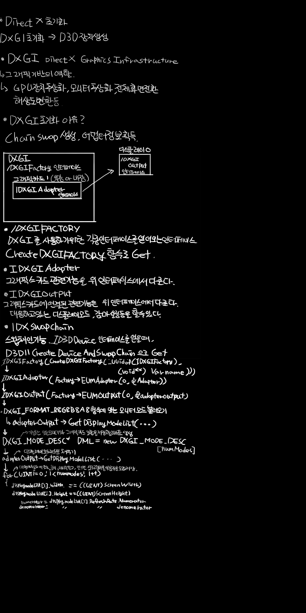
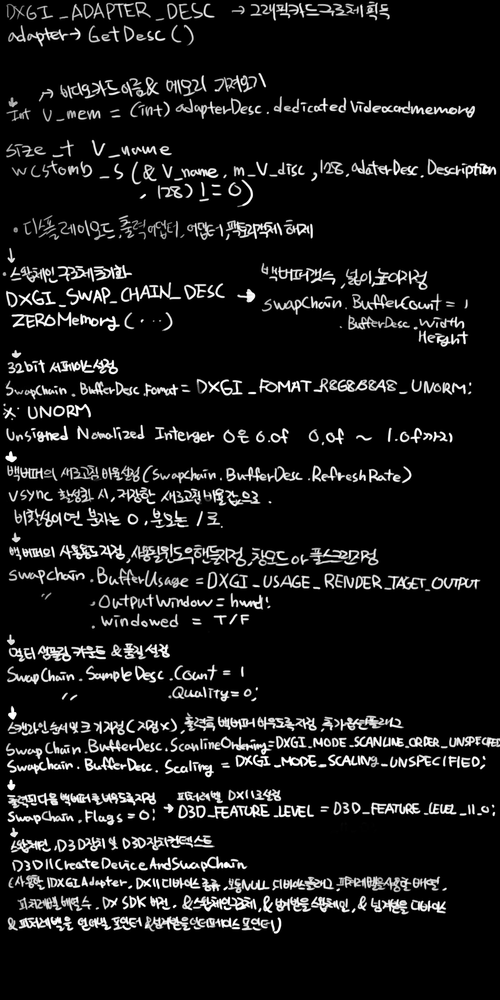
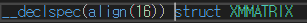

<!-- START doctoc generated TOC please keep comment here to allow auto update -->
<!-- DON'T EDIT THIS SECTION, INSTEAD RE-RUN doctoc TO UPDATE -->


- [DirectX 11 초기화](#directx-11-%EC%B4%88%EA%B8%B0%ED%99%94)

<!-- END doctoc generated TOC please keep comment here to allow auto update -->

# DirectX 11 초기화


`D3D Class`는 `Graphic Class` 내부에 위치하여 있음

모든 그래픽과 관련 된 객체들은 `Graphic Class` 에 캡슐화 되어있음

___



>## 


____
>## GraphicsClass.cpp

1. `GraphicClass` 의 `initialize()` 함수에서 
`D3DClass` 객체를 생성하고 `D3DClass::initialize()` 함수를 호출

2. `D3DClass::initialize()`  함수는 화면의 너비, 높이, VSync유무, 윈도우핸들, 전체화면 유무, 스크린 Depth 와 Near 인수를 입력해줌

```cpp
bool GraphicsClass::Initialize(int screenWidth, int screenHeight, HWND hwnd)
{
	// Direct3D 객체 생성
	m_Direct3D = (D3DClass*)_aligned_malloc(sizeof(D3DClass), 16);
	if (!m_Direct3D)
	{
		return false;
	}

	// Direct3D 객체 초기화
	if (!m_Direct3D->Initialize(screenWidth, screenHeight, VSYNC_ENABLED, 
                                    hwnd, FULL_SCREEN, SCREEN_DEPTH, SCREEN_NEAR))
	{
		MessageBox(hwnd, L"Could not initialize Direct3D.", L"Error", MB_OK);
		return false;
	}

	return true;
}
```

3. `GraphicsClass::Shutdown()` 에서는 `m_direct3D` 객체를 `m_direct3D->ShutDown()` 함수를 통해 반환해줌

```cpp
void GraphicsClass::Shutdown()
{
	// Direct3D 객체 반환
	if (m_Direct3D)
	{
		m_Direct3D->Shutdown();
		delete m_Direct3D;
		m_Direct3D = 0;
	}
}
```

4. `GraphicsClass::Frame()` 에서는 `Render()` 함수를 불러 그래픽 렌더링을 처리해줌

```cpp
bool GraphicsClass::Frame()
{
	// 그래픽 랜더링 처리
	return Render();
}
```

5. `GraphicsClass::Render()` 함수는 `m_direct3D->BeginScene()` 버퍼를 특정 색으로 초기화 하고, `m_direct3D->EndScene()` 을 통해 화면에 출력함.

```cpp
bool GraphicsClass::Render()
{
	// 씬을 그리기 위해 버퍼를 지웁니다
	m_Direct3D->BeginScene(0.9f, 0.9f, 0.3f, 1.0f);


	// 버퍼의 내용을 화면에 출력합니다
	m_Direct3D->EndScene();

	return true;
}
```

____
>## GraphicsClass.h

위에서 이야기 한대로, `D3DClass` 멤버변수를 가지고 있고, `GraphicsClass` 에서  `D3DClass` 를 초기화 하고, 정리하는 코드를 넣을 것이다.

```cpp
#pragma once

class D3DClass : public AlignedAllocationPolicy<16>
{
public:
	D3DClass();
	D3DClass(const D3DClass&);
	~D3DClass();

	bool Initialize(int, int, bool, HWND, bool, float, float);
	void Shutdown();

	void BeginScene(float, float, float, float);
	void EndScene();

	ID3D11Device* GetDevice();
	ID3D11DeviceContext* GetDeviceContext();

	void GetProjectionMatrix(XMMATRIX&);
	void GetWorldMatrix(XMMATRIX&);
	void GetOrthoMatrix(XMMATRIX&);

	void GetVideoCardInfo(char*, int&);


private:
	bool m_vsync_enabled = false;
	int m_videoCardMemory = 0;
	char m_videoCardDescription[128] = { 0, };
	IDXGISwapChain* m_swapChain = nullptr;
	ID3D11Device* m_device = nullptr;
	ID3D11DeviceContext* m_deviceContext = nullptr;
	ID3D11RenderTargetView* m_renderTargetView = nullptr;
	ID3D11Texture2D* m_depthStencilBuffer = nullptr;
	ID3D11DepthStencilState* m_depthStencilState = nullptr;
	ID3D11DepthStencilView* m_depthStencilView = nullptr;
	ID3D11RasterizerState* m_rasterState = nullptr;
	XMMATRIX m_projectionMatrix;
	XMMATRIX m_worldMatrix;
	XMMATRIX m_orthoMatrix;
};
```

____
>## DxDefine.h

헤더에서는 객체 모듈을 사용하기 위해 링크하는 라이브러리들을 명시한다.

이 라이브러리 들은 
1. DX의 초기화 
2. 3D그래픽의 렌더링, 
3. 새로고침 비율을 얻어내거나,
4. 그래픽카드의 정보 등,

하드웨어로의 통신을 위해 필요한 모든 Direct3D 의 기능들을 담고 있음

일부는 DX10 의 라이브러리를 사용하는데, 해당 라이브러리는 DX11 에서도 바뀌지 않았기 때문이다.

이 헤더 파일은 **미리 컴파일 된 헤더**의 이점을 얻기 위해 `stdafx.h` 에 `#include` 되어있다.

```cpp
#pragma once

/////////////
// LINKING //
/////////////
#pragma comment(lib, "d3d11.lib")
#pragma comment(lib, "dxgi.lib")
#pragma comment(lib, "d3dcompiler.lib")


//////////////
// INCLUDES //
//////////////
#include <d3d11.h>
#include <d3dcompiler.h>
#include <directxmath.h>
using namespace DirectX;


///////////////////////////
//  warning C4316 처리용  //
///////////////////////////
#include "AlignedAllocationPolicy.h"
```
___
> ## AlignedAllocationPolicy.h

이 헤더는 [**warning C4316**](https://www.slideshare.net/quxn6/c4316-alignment-error) 처리용 으로 사용되는데,  `warning C4316` 이 경고는  
**[_declspec(align(byte))](http://blog.daum.net/_blog/BlogTypeView.do?blogid=0DAim&articleno=18312691&categoryId=972898&regdt=20110706102745)로 정렬되야 하는 데이터를 멤버로 가지거나, 할당할때 생기는 경고이다.**

이후 `D3DClass.h` 에서 `XMMATRIX` 변수 부분에 대한 에러가 발생되는데, `XMMATRIX` 정의 부분을 보면 


`_declspec(align(16))` 으로 16바이트 정렬을 사용한다고 명시하고 있는데, 

이는 **자주 사용되는 데이터를 특정 프로세서 캐시라인 크기로 정렬하여 한꺼번에 계산하여 CPU캐시 처리 성능을 높혀주는것이다**

게임 프로그래밍에 사용되는 행렬 연산을 고속으로 한꺼번에 처리하기 위해서 [**SSE**](http://spy1233.tistory.com/47) 라는 새로운 명령어 집합이 생겨나게 되면서 이러한 바이트 정렬 연산이 사용되게 된 것이다.

그런데, 이는 스택에서는 별 문제가 되지 않지만 `힙` 에 할당 될때에는 문제가 발생한다.

내장함수인 New 의 경우 **8Byte align**으로 할당 되므로 우리는 **16byte align** 으로 `new`, `delete` 를 새로 만들어서 사용 가능하도록 보장해 주어야 한다.

____
정리하자면, 비주얼 스튜디오에서 제공되는 기본 `new` , `delete` 명령어는 **8byte**. 그러나 `XMMATRIX` 변수의 경우 **16byte**정령을 사용하도록 명시하고 있으므로, HEAP 할당시에 컴파일러는 보장하지 않을것이니 알아서 처리하라.
____

```cpp
#pragma once

// warning C4316 처리용
template<size_t Alignment>
class AlignedAllocationPolicy
{
public:
	static void* operator new(size_t size)
	{
		return _aligned_malloc(size, Alignment);
	}

	static void operator delete(void* memory)
	{
		_aligned_free(memory);
	}
};
```

위와 같이 재정의 템플릿을 생성한 다음, 아래와 같이 사용하자.

```cpp
class D3DClass : public AlignedAllocationPolicy<16>
```

____
>## D3DClass.cpp

이 클래스의 `Initialize()` 함수를 통해 DirectX 를 초기화 할것이며, 

인수로는 
1. 스크린너비, 
2. 스크린 높이, 
3. vsync 유무, 
4. 윈도우 핸들, 
5. 풀스크린 유무,
6. Screen Depth
7.  Screen Near

가 들어간다.

___
> ## Initialize() 함수

```cpp
bool D3DClass::Initialize(int screenWidth, int screenHeight, bool vsync, HWND hwnd, 
                            bool fullscreen, float screenDepth, float screenNear)
{
	// 수직동기화 상태를 저장합니다
	m_vsync_enabled = vsync;

	// DirectX 그래픽 인터페이스 팩토리를 생성합니다
	IDXGIFactory* factory = nullptr;
	if (FAILED(CreateDXGIFactory(__uuidof(IDXGIFactory), (void**)&factory)))
	{
		return false;
	}

	// 팩토리 객체를 사용하여 첫번째 그래픽 카드 인터페이스 어뎁터를 생성합니다
	IDXGIAdapter* adapter = nullptr;
	if (FAILED(factory->EnumAdapters(0, &adapter)))
	{
		return false;
	}

	// 출력(모니터)에 대한 첫번째 어뎁터를 지정합니다.
	IDXGIOutput* adapterOutput = nullptr;
	if (FAILED(adapter->EnumOutputs(0, &adapterOutput)))
	{
		return false;
	}

	// 출력 (모니터)에 대한 DXGI_FORMAT_R8G8B8A8_UNORM 표시 형식에 맞는 모드 수를 가져옵니다
	unsigned int numModes = 0;
	if (FAILED(adapterOutput->GetDisplayModeList(DXGI_FORMAT_R8G8B8A8_UNORM, DXGI_ENUM_MODES_INTERLACED, &numModes, NULL)))
	{
		return false;
	}

	// 가능한 모든 모니터와 그래픽카드 조합을 저장할 리스트를 생성합니다
	DXGI_MODE_DESC* displayModeList = new DXGI_MODE_DESC[numModes];
	if (!displayModeList)
	{
		return false;
	}

	// 이제 디스플레이 모드에 대한 리스트를 채웁니다
	if (FAILED(adapterOutput->GetDisplayModeList(DXGI_FORMAT_R8G8B8A8_UNORM, DXGI_ENUM_MODES_INTERLACED, &numModes, displayModeList)))
	{
		return false;
	}

	// 이제 모든 디스플레이 모드에 대해 화면 너비/높이에 맞는 디스플레이 모드를 찾습니다.
	// 적합한 것을 찾으면 모니터의 새로고침 비율의 분모와 분자 값을 저장합니다.
	unsigned int numerator = 0;
	unsigned int denominator = 0;
	for (unsigned int i = 0; i < numModes; i++)
	{
		if (displayModeList[i].Width == (unsigned int)screenWidth)
		{
			if (displayModeList[i].Height == (unsigned int)screenHeight)
			{
				numerator = displayModeList[i].RefreshRate.Numerator;
				denominator = displayModeList[i].RefreshRate.Denominator;
			}
		}
	}

	// 비디오카드의 구조체를 얻습니다
	DXGI_ADAPTER_DESC adapterDesc;
	if (FAILED(adapter->GetDesc(&adapterDesc)))
	{
		return false;
	}

	// 비디오카드 메모리 용량 단위를 메가바이트 단위로 저장합니다
	m_videoCardMemory = (int)(adapterDesc.DedicatedVideoMemory / 1024 / 1024);

	// 비디오카드의 이름을 저장합니다
	size_t stringLength = 0;
	if (wcstombs_s(&stringLength, m_videoCardDescription, 128, adapterDesc.Description, 128) != 0)
	{
		return false;
	}

	// 디스플레이 모드 리스트를 해제합니다
	delete[] displayModeList;
	displayModeList = 0;

	// 출력 어뎁터를 해제합니다
	adapterOutput->Release();
	adapterOutput = 0;

	// 어뎁터를 해제합니다
	adapter->Release();
	adapter = 0;

	// 팩토리 객체를 해제합니다
	factory->Release();
	factory = 0;

	// 스왑체인 구조체를 초기화합니다
	DXGI_SWAP_CHAIN_DESC swapChainDesc;
	ZeroMemory(&swapChainDesc, sizeof(swapChainDesc));

	// 백버퍼를 1개만 사용하도록 지정합니다
	swapChainDesc.BufferCount = 1;

	// 백버퍼의 넓이와 높이를 지정합니다
	swapChainDesc.BufferDesc.Width = screenWidth;
	swapChainDesc.BufferDesc.Height = screenHeight;

	// 32bit 서페이스를 설정합니다
	swapChainDesc.BufferDesc.Format = DXGI_FORMAT_R8G8B8A8_UNORM;

	// 백버퍼의 새로고침 비율을 설정합니다
	if (m_vsync_enabled)
	{
		swapChainDesc.BufferDesc.RefreshRate.Numerator = numerator;
		swapChainDesc.BufferDesc.RefreshRate.Denominator = denominator;
	}
	else
	{
		swapChainDesc.BufferDesc.RefreshRate.Numerator = 0;
		swapChainDesc.BufferDesc.RefreshRate.Denominator = 1;
	}

	// 백버퍼의 사용용도를 지정합니다
	swapChainDesc.BufferUsage = DXGI_USAGE_RENDER_TARGET_OUTPUT;

	// 랜더링에 사용될 윈도우 핸들을 지정합니다
	swapChainDesc.OutputWindow = hwnd;

	// 멀티샘플링을 끕니다
	swapChainDesc.SampleDesc.Count = 1;
	swapChainDesc.SampleDesc.Quality = 0;

	// 창모드 or 풀스크린 모드를 설정합니다
	if (fullscreen)
	{
		swapChainDesc.Windowed = false;
	}
	else
	{
		swapChainDesc.Windowed = true;
	}

	// 스캔 라인 순서 및 크기를 지정하지 않음으로 설정합니다.
	swapChainDesc.BufferDesc.ScanlineOrdering = DXGI_MODE_SCANLINE_ORDER_UNSPECIFIED;
	swapChainDesc.BufferDesc.Scaling = DXGI_MODE_SCALING_UNSPECIFIED;

	// 출력된 다음 백버퍼를 비우도록 지정합니다
	swapChainDesc.SwapEffect = DXGI_SWAP_EFFECT_DISCARD;

	// 추가 옵션 플래그를 사용하지 않습니다
	swapChainDesc.Flags = 0;

	// 피처레벨을 DirectX 11 로 설정합니다
	D3D_FEATURE_LEVEL featureLevel = D3D_FEATURE_LEVEL_11_0;

	// 스왑 체인, Direct3D 장치 및 Direct3D 장치 컨텍스트를 만듭니다.
	if (FAILED(D3D11CreateDeviceAndSwapChain(NULL, D3D_DRIVER_TYPE_HARDWARE, NULL, 0, &featureLevel, 1,
		D3D11_SDK_VERSION, &swapChainDesc, &m_swapChain, &m_device, NULL, &m_deviceContext)))
	{
		return false;
	}

	// 백버퍼 포인터를 얻어옵니다
	ID3D11Texture2D* backBufferPtr = nullptr;
	if (FAILED(m_swapChain->GetBuffer(0, __uuidof(ID3D11Texture2D), (LPVOID*)&backBufferPtr)))
	{
		return false;
	}

	// 백 버퍼 포인터로 렌더 타겟 뷰를 생성한다.
	if (FAILED(m_device->CreateRenderTargetView(backBufferPtr, NULL, &m_renderTargetView)))
	{
		return false;
	}

	// 백버퍼 포인터를 해제합니다
	backBufferPtr->Release();
	backBufferPtr = 0;

	// 깊이 버퍼 구조체를 초기화합니다
	D3D11_TEXTURE2D_DESC depthBufferDesc;
	ZeroMemory(&depthBufferDesc, sizeof(depthBufferDesc));

	// 깊이 버퍼 구조체를 작성합니다
	depthBufferDesc.Width = screenWidth;
	depthBufferDesc.Height = screenHeight;
	depthBufferDesc.MipLevels = 1;
	depthBufferDesc.ArraySize = 1;
	depthBufferDesc.Format = DXGI_FORMAT_D24_UNORM_S8_UINT;
	depthBufferDesc.SampleDesc.Count = 1;
	depthBufferDesc.SampleDesc.Quality = 0;
	depthBufferDesc.Usage = D3D11_USAGE_DEFAULT;
	depthBufferDesc.BindFlags = D3D11_BIND_DEPTH_STENCIL;
	depthBufferDesc.CPUAccessFlags = 0;
	depthBufferDesc.MiscFlags = 0;

	// 설정된 깊이버퍼 구조체를 사용하여 깊이 버퍼 텍스쳐를 생성합니다
	if (FAILED(m_device->CreateTexture2D(&depthBufferDesc, NULL, &m_depthStencilBuffer)))
	{
		return false;
	}

	// 스텐실 상태 구조체를 초기화합니다
	D3D11_DEPTH_STENCIL_DESC depthStencilDesc;
	ZeroMemory(&depthStencilDesc, sizeof(depthStencilDesc));

	// 스텐실 상태 구조체를 작성합니다
	depthStencilDesc.DepthEnable = true;
	depthStencilDesc.DepthWriteMask = D3D11_DEPTH_WRITE_MASK_ALL;
	depthStencilDesc.DepthFunc = D3D11_COMPARISON_LESS;

	depthStencilDesc.StencilEnable = true;
	depthStencilDesc.StencilReadMask = 0xFF;
	depthStencilDesc.StencilWriteMask = 0xFF;

	// 픽셀 정면의 스텐실 설정입니다
	depthStencilDesc.FrontFace.StencilFailOp = D3D11_STENCIL_OP_KEEP;
	depthStencilDesc.FrontFace.StencilDepthFailOp = D3D11_STENCIL_OP_INCR;
	depthStencilDesc.FrontFace.StencilPassOp = D3D11_STENCIL_OP_KEEP;
	depthStencilDesc.FrontFace.StencilFunc = D3D11_COMPARISON_ALWAYS;

	// 픽셀 뒷면의 스텐실 설정입니다
	depthStencilDesc.BackFace.StencilFailOp = D3D11_STENCIL_OP_KEEP;
	depthStencilDesc.BackFace.StencilDepthFailOp = D3D11_STENCIL_OP_DECR;
	depthStencilDesc.BackFace.StencilPassOp = D3D11_STENCIL_OP_KEEP;
	depthStencilDesc.BackFace.StencilFunc = D3D11_COMPARISON_ALWAYS;

	// 깊이 스텐실 상태를 생성합니다
	if (FAILED(m_device->CreateDepthStencilState(&depthStencilDesc, &m_depthStencilState)))
	{
		return false;
	}

	// 깊이 스텐실 상태를 설정합니다
	m_deviceContext->OMSetDepthStencilState(m_depthStencilState, 1);

	// 깊이 스텐실 뷰의 구조체를 초기화합니다
	D3D11_DEPTH_STENCIL_VIEW_DESC depthStencilViewDesc;
	ZeroMemory(&depthStencilViewDesc, sizeof(depthStencilViewDesc));

	// 깊이 스텐실 뷰 구조체를 설정합니다
	depthStencilViewDesc.Format = DXGI_FORMAT_D24_UNORM_S8_UINT;
	depthStencilViewDesc.ViewDimension = D3D11_DSV_DIMENSION_TEXTURE2D;
	depthStencilViewDesc.Texture2D.MipSlice = 0;

	// 깊이 스텐실 뷰를 생성합니다
	if (FAILED(m_device->CreateDepthStencilView(m_depthStencilBuffer, &depthStencilViewDesc, &m_depthStencilView)))
	{
		return false;
	}

	// 렌더링 대상 뷰와 깊이 스텐실 버퍼를 출력 렌더 파이프 라인에 바인딩합니다
	m_deviceContext->OMSetRenderTargets(1, &m_renderTargetView, m_depthStencilView);

	// 그려지는 폴리곤과 방법을 결정할 래스터 구조체를 설정합니다
	D3D11_RASTERIZER_DESC rasterDesc;
	rasterDesc.AntialiasedLineEnable = false;
	rasterDesc.CullMode = D3D11_CULL_BACK;
	rasterDesc.DepthBias = 0;
	rasterDesc.DepthBiasClamp = 0.0f;
	rasterDesc.DepthClipEnable = true;
	rasterDesc.FillMode = D3D11_FILL_SOLID;
	rasterDesc.FrontCounterClockwise = false;
	rasterDesc.MultisampleEnable = false;
	rasterDesc.ScissorEnable = false;
	rasterDesc.SlopeScaledDepthBias = 0.0f;

	// 방금 작성한 구조체에서 래스터 라이저 상태를 만듭니다
	if (FAILED(m_device->CreateRasterizerState(&rasterDesc, &m_rasterState)))
	{
		return false;
	}

	// 이제 래스터 라이저 상태를 설정합니다
	m_deviceContext->RSSetState(m_rasterState);

	// 렌더링을 위해 뷰포트를 설정합니다
	D3D11_VIEWPORT viewport;
	viewport.Width = (float)screenWidth;
	viewport.Height = (float)screenHeight;
	viewport.MinDepth = 0.0f;
	viewport.MaxDepth = 1.0f;
	viewport.TopLeftX = 0.0f;
	viewport.TopLeftY = 0.0f;

	// 뷰포트를 생성합니다
	m_deviceContext->RSSetViewports(1, &viewport);

	// 투영 행렬을 설정합니다
	float fieldOfView = 3.141592654f / 4.0f;
	float screenAspect = (float)screenWidth / (float)screenHeight;

	// 3D 렌더링을위한 투영 행렬을 만듭니다
	m_projectionMatrix = XMMatrixPerspectiveFovLH(fieldOfView, screenAspect, screenNear, screenDepth);

	// 세계 행렬을 항등 행렬로 초기화합니다
	m_worldMatrix = XMMatrixIdentity();

	// 2D 렌더링을위한 직교 투영 행렬을 만듭니다
	m_orthoMatrix = XMMatrixOrthographicLH((float)screenWidth, (float)screenHeight, screenNear, screenDepth);

	return true;
}
```

1. 수직 동기화 상태 저장


2. DirectX 그래픽 인터페이스 팩토리 (DXGI)생성
	
	
	
3. 팩토리 객체를 사용하여 1번 그래픽카드 인터페이스 어댑터 생성

	```
	CreateDXGIFACTTORY();

	그래픽 카드관련 기능을 위 인터페이스에서 다룬다
	```
4. 출력모니터에 대한 첫번째 어댑터 지정

	```
	그래픽 카드에 연결된 관련 기능을 다룸
	(대응 디스플레이모드, 감마 설정 등)
	```
5. 출력모니터에 대한 `DXGI_FORMAT_R8G8B8A8_UNORM` 표시 형식에 맞는 모드 수 가져오기
6. 가능한 모든 모니터와 그래픽 카드 조합을 저장할 리스트 생성
7. 디스플레이 모드에 대한 리스트 채우기
8. 모든 디스플레이 모드에 대해 화면/높이 에 맞는 디스플레이 모드를 찾고, 만약 찾으면 모니터의 새로고침 비율의 분모와 분자값을 저장
9.  비디오 카드의 구조체를 얻음
10. 비디오 카드 메모리 용량 단위를 메가바이트 단위로 저장
11. 비디오 카드 이름을 저장
12. 디스플레이 모드 리스트를 해제
13. 촐력 어댑터 객체를 해제
14. 어댑터 객체를 해제
15. 팩토리 객체를 해제
16. 스왑체인 구조체 정의 및 초기화
17. 백버퍼 갯수 지정
18. 백버퍼의 넓이와 높이 지정
19. 32bit 서페이스 설정
20. 백버퍼의 새로고침 비율을 설정
21. 백버퍼의 사용용도를 지정
22. 렌더링에 사용될 윈도우 핸들을 지정
23. 멀티샘플링 갯수와 품질 설정
24. 창모드 or 풀 스크린 모드를 설정
25. 스캔 라인 순서 및 크기 설정
26. 출력된 다음 백버퍼를 비우도록 지정
27. 추가 옵션 플래그 설정
28. 피쳐레벨 설정
29. 스왑체인, DX3D장치 및 DX3D 장치 컨텍스트 생성
30. 백버퍼 포인터 얻기
31. 백버퍼 포인터를 해제
32. 깊이 버퍼 구조체를 정의 및 초기화
33. 깊이 버퍼 구조체 작성
34. 깊이 버퍼 구조체를 사용하여 깊이 버퍼 텍스쳐를 생성
35. 스텐실 상태 구조체를 정의 및 초기화
36. 스텐실 상태 구조체 작성
37. 픽셀 정면의 스텐실 설정
38. 픽셀 뒷면의 스텐실 성정
39. 깊이 스텐실 상태 생성
40. 깊이 스텐실 뷰의 구조체를 초기화
41. 깊이 스텐실 뷰 구조체 설정
42. 깊이 스텐실 뷰 설정
43. 렌더링 대상뷰와 깊이 스텐실 버퍼를 출력 렌더 파이프라인에 할당
44. 그려지는 폴리곤과 방법을 결정할 래스터라이저 설정
45. 44에서 작성한 구조체에서 래스터라이저 상태를 만듬
46. 래스터 라이저 상태를 설정
47. 렌더링을 위해 뷰포트 설정
48. 투영 행렬 설정
49. 3D 렌더링을 위한 투영 행렬 만듬
50. 세계 행렬을 항등 행렬로 초기화
51. 2D 렌더링을 위한 직교 투영 행렬을 만듬


___
> ## ShutDown 함수

```cpp
void D3DClass::Shutdown()
{
	// 종료 전 윈도우 모드로 설정하지 않으면 스왑 체인을 해제 할 때 예외가 발생합니다.
	if (m_swapChain)
	{
		m_swapChain->SetFullscreenState(false, NULL);
	}

	if (m_rasterState)
	{
		m_rasterState->Release();
		m_rasterState = 0;
	}

	if (m_depthStencilView)
	{
		m_depthStencilView->Release();
		m_depthStencilView = 0;
	}

	if (m_depthStencilState)
	{
		m_depthStencilState->Release();
		m_depthStencilState = 0;
	}

	if (m_depthStencilBuffer)
	{
		m_depthStencilBuffer->Release();
		m_depthStencilBuffer = 0;
	}

	if (m_renderTargetView)
	{
		m_renderTargetView->Release();
		m_renderTargetView = 0;
	}

	if (m_deviceContext)
	{
		m_deviceContext->Release();
		m_deviceContext = 0;
	}

	if (m_device)
	{
		m_device->Release();
		m_device = 0;
	}

	if (m_swapChain)
	{
		m_swapChain->Release();
		m_swapChain = 0;
	}
}
```

1. 종료전 윈도우 모드로 설정 (예외발생하기때문)
2. 래스터라이저 해제
3. 깊이 스텐실 뷰 해제
4. 깊이 스텐실 상태 해제
5. 깊이 스텐실 버퍼 해제
6. 렌더 타겟 뷰 해제
7. 장치 컨텍스트 해제
8. 장치 해제
9. 스왑 체인 해제

___
> ## BeginScene 함수

```cpp
void D3DClass::BeginScene(float red, float green, float blue, float alpha)
{
	// 버퍼를 지울 색을 설정합니다
	float color[4] = { red, green, blue, alpha };

	// 백버퍼를 지웁니다
	m_deviceContext->ClearRenderTargetView(m_renderTargetView, color);

	// 깊이 버퍼를 지웁니다
	m_deviceContext->ClearDepthStencilView(m_depthStencilView, D3D11_CLEAR_DEPTH, 1.0f, 0);
}
```

1. 버퍼를 지울 색 설정
2. 백 버퍼를  wipe
3. 깊이 버퍼를 wipe

___
> ## EndScene 함수

```cpp
void D3DClass::EndScene()
{
	// 렌더링이 완료되었으므로 화면에 백 버퍼를 표시합니다.
	if (m_vsync_enabled)
	{
		// 화면 새로 고침 비율을 고정합니다.
		m_swapChain->Present(1, 0);
	}
	else
	{
		// 가능한 빠르게 출력합니다
		m_swapChain->Present(0, 0);
	}
}
```

1. Vsync 유무에 따라
1. 화면 새로 고침 비율 고정
2. 아니면 가능한 빠르게 출력

```cpp

```