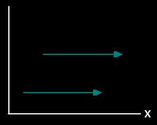
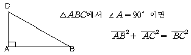
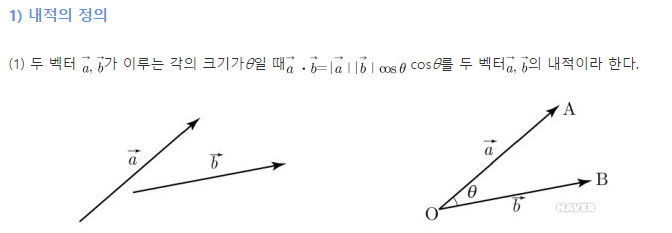
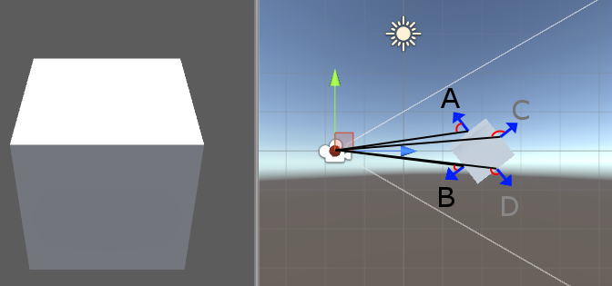
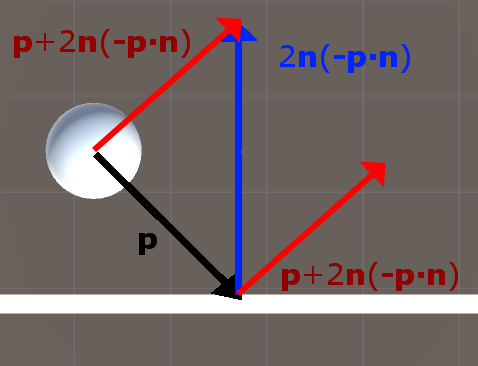
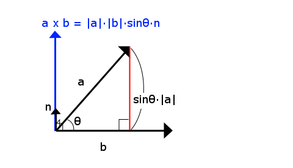
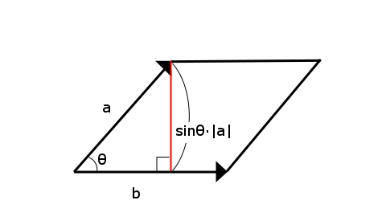

# Vector

> ## Vector

`Vector = Magnitude & Direction`

벡터는 크기와 방향을 동시에 나타낸다.

예를 들어 어떤 물체가 5km/h 간다고 하자. 이때 어느 방향으로 가는지는 알수 없기때문에 벡터라고 할수 없다.

이 값은 속력이고, 스칼라라고 할 수 있다.

반면에 어떤 물체가 동쪽으로 5km/h 간다고 하자. 이제 시속 5km 와 동쪽이 합치면 속도(Velocity) 라고 부를 수 있게 된다. 

이 속도는 크기와 방향을 가졌기 때문에 벡터라고 할 수 있다.

벡터는 2차원 좌표 평면 상에서 표현하자면,   

벡터는 어디서 시작하는지 상관없이 **크기와 방향이 같다면 같은 벡터**라고 할수 있다.

`스칼라: 스칼라는 **크기만을 나타내는 물리량**으로 길이, 넓이, 시간, 온도, 질량, 무게, 속력, 에너지 등을 말한다.`
`벡터: 벡터는 **크기와 동시에 방향을 갖는 물리량으로서** 변위, 속도, 가속도, 힘, 운동량, 전기장, 자기장, 각운동량등을 말한다.`

출처: https://boycoding.tistory.com/52 [소년코딩]`
 
> ## Vector 의 덧셈

아래와 같은 2차원 벡터가 있을때,
$$
\vec{A}(6 ,-2) , \vec{B}(-4, 4 )
$$

덧셈은 각 요소를 더하면 된다.
$$
\vec{C} = \vec{A} + \vec{B}
$$
$$
\vec{C} = (\vec{A}x+\vec{B}x) ,(\vec{A}y+\vec{B}y))  
$$

 
 위 그림을 보면 초록색과 파란색 벡터를 더했을때, 

 빨간색 벡터가 나오는데, 이는 초록색이나 파란색의 화살표 머리부분에서 다른 벡터를 더하면 빨간색의 머릿부분이 나온다

> ## Vector 와 스칼라 곱셈

벡터 A(2,1) 가 있다고 하자.

만약 VA 에 3을 곱한다면, 각 요소에 곱하면 된다.

VA = (6, 3) 이 된다. 이 경우 스칼라 곱은 벡터의 크기만 크게 해주었다.

반대로 -1을 곱한다면 ? 

VA = (-2, -1) 이 된다. 이번에는 방향이 정반대로 가 된다.

> ## 단위 벡터

단위 벡터란 길이가 1인 벡터를 말하며, 벡터의 각 요소를 벡터의 크기로 나누면 단위벡터가 나온다.

그렇다면 벡터의 크기는 어떻게 구할까?

>## 벡터의 크기

각각의 성분을 제곱하고 모두 더한 값의 제곱근

> ### 2차원 벡터의 크기

2차원 좌표 평면 상의 벡터 A 가 있을때, 아래 그림을 보면 직각 삼각형이란 것을 알 수있다.

우리는 피타고라스 정리를 통해 빗변의 길이를 구하면 그것이 바로 벡터의 길이가 될것이다.

예를 들어 $\vec{V}(5,4)$ 가 있을때 피타고라스 정리를 적용하면,

벡터V 의 길이 = ㅣㅣAㅣㅣ 라고 표기할때

$||v||^2 = \vec{Ax}^2 + \vec{Ay}^2$

$||v||= \sqrt{25 + 16}$

$||v|| = \sqrt{41}$

벡터 A의 길이는 $\sqrt{41}$ 이 되고, 이것을 가지고 단위 벡터를 구해보자

$\vec{A}(5,4)$ 의 단위벡터는 $5 \over \sqrt{41}$, $4 \over \sqrt{41}$가 된다.

검산을 해보자면,

$$
\vec{A} 의 길이는  \sqrt{41}, 단위벡터는 1
$$

$$
 \sqrt{({5 \over \sqrt{41}})^2 + ({4 \over \sqrt{41}})^2} 
$$
$$
 = \sqrt{{25 \over 41} + {4 \over 41}} 
$$
$$
 = \sqrt{{41 \over 41}} 
$$
$$
 = 1
$$

> ### 3차원 벡터의 크기

3차원 벡터의 크기는 피타고라스의 정리를 2번 적용하면 구할 수 있다.

$\vec{V}(x,y,z)$ 가 있을때, 

벡터의 크기는

$||v|| = \sqrt{(x^2 +y^2 +z^2)}$

결국 다차원 에 대한 벡터의 크기 공식은

$||v|| =  \sqrt{(v0^2 + v1^2 + v2^2... + vn^2)}$

> ### 벡터의 내적

1. 내적

두벡터 $\vec{A},\vec{B}$ 가 이루는 각의 크기가 $\Theta$ 일때,
$\vec{A},\vec{B} = $ |\vec{A}|,|\vec{B}| \cos\Theta$ $\cos\Theta$ 를 두 벡터 $\vec{A},\vec{B}$ 의 내적이라 한다.

내적은 물체가 빛을 받으면 명암이 생기는데, 이 명암을 모델링할때,
벡터의 내적 연산이 사용되며, 또한 백컬링시 렌더링에서 제외하기 위한 계산에도 벡터의 내적이 사용된다.

폴리곤에서 카메라 쪽으로 향하는 벡터와, 폴리곤의 법선 벡터를 내적하여, 그 결과값이 0보다 작다면 뒷부분으로 판단한다.

위 검은선은 각 폴리곤으로 부터 카메라쪽으로 향하는 벡터를 나타낸 것이고, 이때 두 벡터 사이의 각도가 90도 이하면 해당 폴리곤은 카메라를 바라본다라고 판달 할수 있다.

출처 : [게임코디 태풍의 그라운드님](http://lab.gamecodi.com/board/zboard.php?id=GAMECODILAB_Lecture_series&no=125&z=)

2. 내적의 계산

벡터의 각 성분들끼리 곱셈을 한 뒤 그 결과를 더해주면 내적이 계산된다.

$$
\vec{a}(2,2)
\vec{b}(-1,0) 
\vec{a} * \vec{[b]} = (-2,0)
= -2

\vec{c}(-2,-2)
\vec{b}(-1,0) 
= 2
$$

결과가 양수라면 90도보다 같거나 작다라는것이며, 음수가 나오면 
각이 90도 보다 크다는 것이다.

3. 반사 벡터 구하기

출처 : [게임코디 태풍의 그라운드님](http://lab.gamecodi.com/board/zboard.php?id=GAMECODILAB_Lecture_series&no=125&z=)

내적을 이용해서 반사 벡터를 구해보자.

벡터 P 가 공의 속도 벡터일때, n 은 벽의 법선벡터 일때, 

반사벡터 의 공식은

$P + 2n(-p ∙ n)$

> ### 벡터의 외적

1. 외적

외적의 결과값은 또다른 벡터 하나가 생기는데 이 벡터는 두벡터에 모두 수직인 벡터가 되며, 외적은 3차원 벡터에서만 적용된다.

즉 법선 벡터를 구할때 벡터의 외적을 사용한다.

a,b 를 \vec{A},\vec{B} 라고 하였을때, 외적의 공식은

$$
a X b =  [(ay·bz – az·by), 
          (az·bx – ax·bz),
          (ax·by – ay·bx)]
$$

공식으로 구한 벡터의 X 성분은 두벡터의 y, z 값을 교차해서 곱한뒤 서로 뺀 값이다.

또한 외적은 벡터 A , B 의 길이 곱하기 sin(세타) 곱하기 법선벡터
로 구할수 있다.

$|\vec{A}| * |\vec{B}| * \sin(\Theta) * \vec{normal}$

위 그림에서 높이 값은 $\sin(\Theta) * |\vec{A}|$ 로 구할 수 있다.

여기서 벡터 a,b 에 모두 수직이면서 길이가 1 인 벡터 n 이 있다고 할때, 아래의 공식을 적용하면

$\sin(\Theta) * |\vec{A}| * |\vec{B}|$  =  스칼라 값

이때 법선벡터 n 을 곱해주면, n 의 확장 하게 된다.

따라서 a,b 의 외적은 아래 공식으로 구할수 있다.

$|\vec{A}| * |\vec{B}| * \sin(\Theta) * \vec{normal}$ 

그러나 프로그래밍에서 삼각함수는 비용이 많이 들기 때문에, 

$$
a X b =  [(ay·bz – az·by), 
          (az·bx – ax·bz),
          (ax·by – ay·bx)]
$$

각 성분을 곱해주는 것이 좋다.

이를 통해 평행사변형의 넓이를 구할수 있다.

만약 벡터 b가 빗변이 벡터 a라고 할때, sin(세타) * a 의 길이를 곱해주면 높이를 구할수 있고, 

평행사변형의 넓이는 밑변 * 높이 를 해주어서 구하면 된다.

