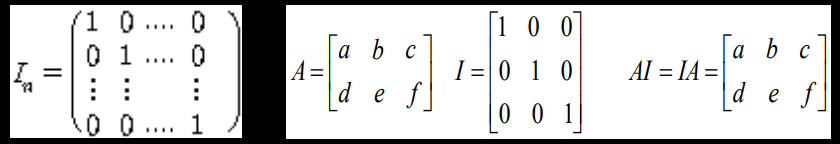
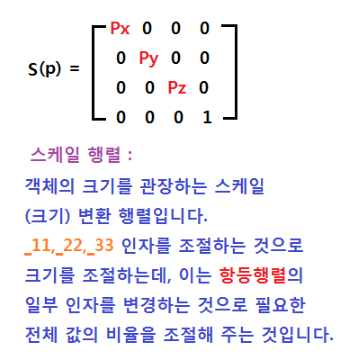
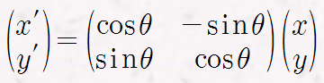

# Matrix


대부분의 D3D API 는 화면상에 무언가를 렌더링 하고자 할때 거의 행렬을 사용한다.

행렬을 잘 사용한다면, 복잡한 방정식도 쉽게 풀 수 있다.

예를 들어 아래와 같은 방정식을 풀때,

$X = 3a + 4b +5c$
$Y = 1a + 5b +-2c$
$Z = 1a + 3b +6c$

아래와 같이 표시를 해줄수 있다.

 [X Y Z] = ┌..3..4.-5.┐┌ a ┐
 [X Y Z] = │..1..5.-2.││ b │
 [X Y Z] = └..7.-2..3.┘└ c ┘


즉 행렬은 여러가지 복잡한 연산이 있을 때 여러개의 순차연산을 하나의 행렬로 만들어서 게산할 수있다.

D3D 에서는 XMFLOAT 과 마찬가지로 XMMATRIX 라는 구조체를 제공하고 있다.

이 구조체는 4 * 4 사이즈의 행렬을 표현 해준다.

> ## 행렬

행렬에서 성분은 보통 소문자로 $Aij, Bij, Cij$ 등으로 나타내며

각각의 소문자 i, j 는 행렬의 행(i, 가로) 과 열(j, 세로) 을 나타낸다.

1. 행렬의 차원

행렬의 크기를 말하며, **행렬의 크기는 (행의 개수) X (열의 개수)**로 나타낸다.

이때, 행과 열의 수가 같으면 **정방 행렬** 이라고 하며, m=n 이면 n차 정방 행렬 이라고 한다.

2. 행벡터, 열벡터

행렬의 특수한 형태로 오직 한개의 행, 혹은 열을 가지는 행렬을 말한다.

> ## 단위행렬


먼저 단위 행렬은 가장 간단한 이동 행렬의 하나이다.

주 대각원소가 모두 1이고 나머지 원소가 0으
로 이루어진 정방행렬이다.

단위 행렬은 행렬 연산에 아무런 영향도 미치지 않는, 즉 자연수에서 '1' 과 같은 역할을 하는것이다.

단위 행렬은 보통 `I` 로 표기하며, 행렬 m 과 단위 행렬의 연산 결과는 항상 m 이 된다.




D3D 에서 제공하는 단위 행렬 생성 함수는 아래와 같다

```cpp
XMMATRIXIdentity(XMMATRIX* pOut);
// pOut 으로 넘겨준 행렬 구조체에 단위 행렬 정보가 저장됨
```

> ## 이동 행렬
 


이동 행렬은 단순한 덧셈 연산이며, 아래와 같은 식으로 행렬 형식을 취한다.


행렬 41,42,43 번째 행에 각각의 축에서 이동값을 나타낸다.

또한 이 값은 객체의 로컬 좌표의 중심 좌푤르 변경 시켜 준다.

오브젝트의 정점들은 오브젝트의 중심값에서 얼마만큼씩 거리를 가진다는 상대적이 좌표를 기지고 있다.

그러므로, 월드 스페이스에서는 특정 3D 객체의 중심 좌표를 지정하게 되고, 이 오브젝트에 소속된 정점들은 해당 줌심으로 부터 상대적 좌표값만큼 거리를 가진 상태로 설정되는 것이다.

또한 이값은 회전 행렬의 연산값으로 부터 독립 적이다.

```cpp
//월드, 이동 행렬 선언
//행렬을 항등 행렬로 초기화 해주는 함수
//11,22,33,44 값을 1로 초기화 하고 나머지 요소를 0으로 초기화
XMMATRIXIdentyty(&matWorld);
XMMATRIXIdentyty(&matTrans);

//행렬 초기화
XMMATRIXTranslation(&matTrans, 0.0f, 0.0f, 0.0f);

//이동행렬값을 월드 행렬 값으로 설정
matWorld = matTrans;

//월드행렬 설정
m_Device->GetDevice()->SetTransform(D3DTS_WORLD, &matWorld);
```

> ## 크기 변환 행렬



스케일 행렬이라고도 한다.

크기 변환 행렬은 몇가지 인자들을 데이터에 곱함으로써 데이터의 크기를 조정한다.

행렬의 11,22,33 요소를 조절 하는 것으로 크기를 조절하는데, 이는 항등 행렬의 일부 인자를 변경하는 것만으로 필요한 전체값의 비율을 조절해 준다.

그런데 11,22,33 요소는 회전행렬에 포함되는 요소이다.

11~ 33 까지의 요소는 행렬의 값을 통해 식을 세우고, 이식으로 변동된 새로운 좌표를 만드는 역할에 사용된다.


```cpp
//월드, 이동 행렬 선언
//행렬을 항등 행렬로 초기화 해주는 함수
//11,22,33,44 값을 1로 초기화 하고 나머지 요소를 0으로 초기화
XMMATRIXIdentyty(&matWorld);
XMMATRIXIdentyty(&matScale);

//행렬 초기화
XMMATRIXScaling(&matScale, 1.0f, 1.0f, 1.0f);

//이동행렬값을 월드 행렬 값으로 설정
matWorld = matScale;

//월드행렬 설정
m_Device->GetDevice()->SetTransform(D3DTS_WORLD, &matWorld);
```

이때 44번째 요소에 1이 끼어 있는데, 간단한 곱셈만 할대에는 44번째 요소가 없어도 계산결과는 동일하다.

그러나 이 크기 변환 행령이 이동 행렬과 양립 할수 있도록(행과 열이 동일하도록) 4번째 행을 유지 시켜야한다. 

이를 **호모지니어스 좌표**라고 한다.


> ## 회전 행렬

회전 행렬은 3D 그래픽스 행렬 체계의 핵심으로, 
11 ~ 13
21 ~ 23
31 ~ 33 
인자가 담당하며, 오일러 각 회전 이론을 적용 시켜 둔 상태이다.

또한 오브젝트의 높이 방향 이 Y축이라고 했을때
X축 회전은 Pitch, 회전은 Yaw(기우뚱해지다), Z축은 Roll 로 정의한다.



위 수식은 2차원 좌표계의 회전을 나타내며, 위 수식에서 $\Theta$ 만큼 각도를 변경했을때 기존 좌표 x' y' 를 삼각함수로 연산하여 회전된 좌표를 구하는 것이다.

위 행렬식을 풀어서 쓰면 아래와 같은 식이된다.

$X' = (\cos\Theta * X) + (-\sin\Theta * Y)$
$Y' = (\sin\Theta * X) + (-\cos\Theta * Y)$

예를 들어 X축을 기준으로 회전하는 Y,Z 좌표를 구하는 회전행렬은 아래와 같으며, 


행렬식을 풀어서 쓰면

$X' = X$
$Y' = (\cos\Theta * X) + (-\sin\Theta * Y)$
$Z' = (\sin\Theta * X) + (-\cos\Theta * Y)$

X축을 기준으로 회전 하기 때문에 X는 변하지 않는다.


Y축은 마찬가지로 Y축이 변하지 않는다.


Z 도 마찬가지이다.

```cpp
//X축 회전, Y, Z축도 함수만 다른뿐 내용은 같음

//월드, 회전 행렬 선언
XMMATRIXIdentyty(&matWorld);
XMMATRIXIdentyty(&matRotX);

//행렬 초기화
XMMATRIXRotationX(&matRotX, XMConvertToRadians(0.0f));
//대상 행렬과 라디안 각도를 인자로 받는다.

//회전행렬값을 월드 행렬 값으로 설정
matWorld = matScale;

//월드행렬 설정
m_Device->GetDevice()->SetTransform(D3DTS_WORLD, &matWorld);
```

```cpp
//디그리 -> 라디안
XMConvertToRadians(); == ((degree) * (PI / 180.0f);

//라디안 ->디그리
XMConvertToDegrees(); == ((radians) * (180.0f / PI);
```

그렇다면 여러축으로 회전은 어떻게 해야할까

```cpp
//월드 행렬, 각 축의 회전 행렬 선언
//회전 행렬은 열거형을 사용한 배열 선언
XMMATRIX matWorld;
XMMATRIX matRot[Angle_END];

//월드, 회전 행렬 선언
XMMATRIXIdentyty(&matWorld);
for(int i = 0; i < Angle_END; i++)
{   
    XMMATRIXIdentyty(&matRot[Angle_END]);
}

XMMATRIXRotationX(&matRot[Angle_X], XMConvertToRadians(320.f));

XMMATRIXRotationX(&matRot[Angle_Y], XMConvertToRadians(150.f));

XMMATRIXRotationX(&matRot[Angle_Z], XMConvertToRadians(20.f));

matWorld = matRot[Angle_X] * matRot[Angle_Y] * matRot[Angle_Z];

//월드행렬 설정
m_Device->GetDevice()->SetTransform(D3DTS_WORLD, &matWorld);
```

Rotation 을 이용한 회적 적용은 각축에 대한 회전이 개별적으로 이루어 지는 것이다.

개별적으로 회전된 값을 곱으오 합산하여 결과를 월드행렬에 반영하는것인데, 이를 오일러 회전이라고 한다.

위 코드를 보면 XYZ 순으로 회전 행렬을 곱했는데,

이경우 Z -> Y -> X 순서로 회전을 한다

이때 각축의 회전시에 남은 축들은 현재 회전의 대상이 되는 축에 종속적으로 동작한다.

종속된 축의 상위 축이라면 회전하지않는다.

먼저 Z축이 회전하면 Y,X 축이 Z축 회전을 따라서 회전을 한다.

이 다음 Y 축이 회전 할때는 Z축 만큼 회전된 상태인 축을 기준으로 삼게된다

Y가 회전 할때는 X축이 회전값만큼 회전한다. 이때 먼저 회전했던 Z축은 변하지 않는다.

마지막으로 X축이 회전하게 되는데 이미 이전 Y,Z 축의 회전으로 인해 많이 회전된 상태이며, X축은 최하위 축이기 때문에 위에서 말했다시피, Y,Z 축은 회전하지 않는다.


> ## 세가지 행렬

마지막으로 위 코드에서 XYZ 축 모두를 움직일때 세 축을 모두 곱해 준것 처럼, 이동, 크기변환, 회전을 모두 사용하고 싶다면 세가지 행렬을 모두 곱해주면 된다.

그러나 행렬을 곱하는 것은 하나의 행렬에 모든 행렬의 결과를 반영하기 위한 과정이므로, 아래의 순서를 꼭 지켜서 연산해 주어야한다.

행렬은 기본적으로 결합 법칙이 성립하지 않기 때문이다.

**스케일 * 회전 * 이동 * 공전 * 부모**

이때 공전행렬과 부모행렬은 공전을 위한 행렬이다.

공전이란 전체 버텍스가 부모의 위치를 중심으로 함께 회전하는 것이며, 그렇기때문에 공전과 부모행령을 설정해주는 것이다.


> ## 참고 및 이미지 출처
1. http://eirenehue.egloos.com/982042
2. http://elearning.kocw.net/document/04_9.pdf
3. https://backga.tistory.com/19
