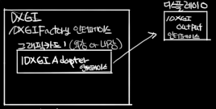
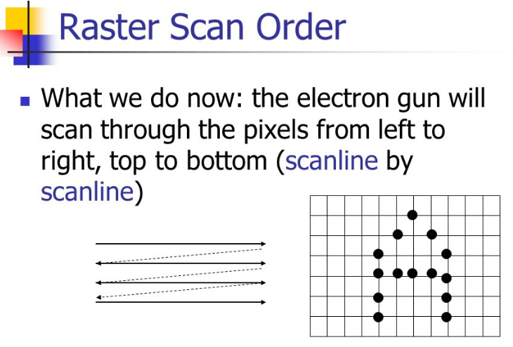
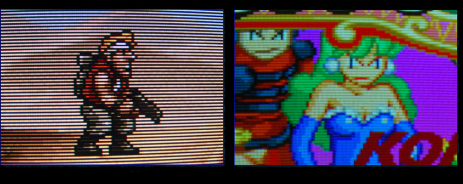
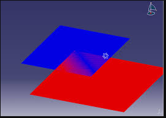

# DirectX 11 초기화2

간략하게 정리.



>## DXGI

DXGI (DirectX Graphic Interfurastrcture)

커널모드 구동기와 로우레벨 통신을 책임지며, 하드웨어 자원 관리 또한 담당한다.

사용자 모드 구동기에서 생성된 명령 목록에 기초하여 하드웨어 자원을 관리한다.

이 구동기 아래에서  GPU가 응용 프로그램에게 동시에 주어지므로 GPU 접근 권한에 대한 문제를 신경 쓸 필요가 없다.

>## IDXGIFactory 

DXGI 를 사용하기 위해 필요한 각종 인터페이스를 얻어오는 인터페이스이다.

`CreateDXGIFactory()` 를 사용하여 얻어온다.

>## IDXGIAdapter

그래픽 카드 관련 기능을 위 인터페이스에 다룬다.
칩셋에 내장된 그래픽스 기능인 경우도 있다.

>## IDXGIOutput

그래픽 카드에 연결된 디스플레이 관련 기능이다.
대응 디스플레이 모드나, 감마 설정을 할수 있다.

>## IDXGISwapChain
화면을 표시하는 스왑체인의 기능이다.

>## DXGI_MODE_DESC

```cpp
UINT Width;                                 // 원하는 back buffer 너비
    UINT Height;                                // 원하는 back buffer 높이
    DXGI_RATIONAL RefreshRate                   // 디스플레이 모드 갱신율
    DXGI_FORMAT Format;                         // back buffer 픽셀 형식
    DXGI_MODE_SCANLINE_ORDER ScanlineOrdering;  // 디스플레이 스캔라인 모드
    DXGI_MODE_SCALING Scaling;                  // 디스플레이 비례 모드
```

생성하고자 하는 백버퍼의 속성들을 서술하는 구조체

DXGIOutput->getDisplayModeList 를 통해 가능한 모든 모니터와 그래픽 카드 조합을 저장할 리스트를 가져올 수 있다.

이후 윈도우 구조체에서 정한 화면 너비/높이 에 맞는 디스플레이 모드를 찾아서 새고고침 비율의 분모와 분자값을 저장한다.

>## DXGI_ADAPTER_DESC

비디오 카드 구조체, 그래픽카드 환경을 얻을수 있다.

비디오카드의 이름이나 메모리, 하드웨어 아이디나, 공유되고 있거나, CPU, 혹은 GPU 와 공유 되고 있지 않은 시스템 메모리나, 비디오 메모리의 정보를 얻을수 있다.

>## DXGI_SWAP_CHAIN_DESC

```cpp
typedef struct DXGI_SWAP_CHAIN_DESC
{
    DXGI_MODE_DESC BufferDesc;      // 생성하고자 하는 back buffer의 속성들을 서술하는 구조체
    DXGI_SAMPLE_DESC SampleDesc;    // Multisampling을 위해 추출할 표본 개수와 품질 수준을 서술하는 구조체
    DXGI_USAGE BufferUsage;         // 버퍼의 용도를 서술하는 구조체
    UINT BufferCount;               // Swap chain에서 사용할 back buffer의 개수.(이중버퍼링 : 1개, 삼중버퍼링 : 2개)
    HWND OutputWindow;              // 렌더링 결과를 표시할 윈도우 창의 핸들
    BOOL Windowed;                  // 창 모드를 원하면 true, 전체화면 모드를 원하면 false
    DXGI_SWAP_EFFECT SwapEffect;    // Swap 효과를 서술하는 구조체
    UINT Flags;                     // 추가적인 플래그
} DXGI_SWAP_CHAIN_DESC;

```

스왑 체인 구조체

`DXGI_USAGE` 는 백버퍼용, RTV 용, SHARED, READ_ONLY 등 여러가지 옵션이 있다.

`BufferDesc` 구조체는 스캔라인 순서 및 크기 등을 지정할수 있다.

 

 

>## D3D_FEATURE_LEVEL

피쳐레벨은 GPU 에 따라 지원하는 DirectX 의 기능 수준을 지정 하는 것이다. 장치생성이 성공하면 해당 기능 수준이 존재하는 것이고 그렇지 않으면 해당 기능을 지원하지 않는다.

[각 기능 수준의 대한 개요](https://docs.microsoft.com/ko-kr/windows/desktop/direct3d11/overviews-direct3d-11-devices-downlevel-intro)

>## ID3D11Device

쉐이더 프로그램 객체, 자원, 상태 객체, 질의 객체 등의 생성을 위한 여러 메서드를 제공하고, 또한 여러 하드웨어 기능들의 사용 가능 여부를 점검하는 메서드 들과 진단 및 디버깅 관련 메서드 들도 제공한다.

대체로 `ID3D11Device` 는 응용 프로그램에서 사용 할 여러 자원들을 공급하는 존재라고 볼수 있으며, `D3D_FEATURE_LEVEL` 를 캡슐화 하는 역할도 한다. 

>## ID3D11DeviceContext

장치 문맥, 장치 내용 이라는 말이지만, 이때 이 장치가 하드웨어 장치 만 의미하는 것이아니라 특정 개체가 그 하나로서 독립적이면 전부 Device 라고 하는것 같다.

예를 들어 응용 프로그램 하나가 Device 라면 Device Context 의 의미가 이해 갈것이다.

Device 에 대한 각종 정보를 담고 잇는 구조체이며, WAPI 에서 Device 는 하나의 응용 프로그램을 의미한다. 

>## ID3D11Texture2D

백버퍼에 접근하는 인터페이스 이며, 백버퍼의 포인터를 가져올수 있다.
이때 백버퍼가 2D 인 이유는 백버퍼는 이미 화면이 그려진 하나의 2D Texture 이기 때문이다. 

>## D3D11_TEXTURE2D_DESC

2차원 텍스쳐 구조체 이며, `Usage` 와 `BindFlags` 를 통해서  깊이 버퍼 나, 렌더 타겟 뷰 용도로 사용 할수 있다.

>## RenderTargetView

렌더 대상 뷰 

렌더링 파이프라인의 출력을 받을 자원을 연결하는데 사용 된다.

2차원 텍스처와 다른 종류의 자원을 렌더 타겟에 연결하는 것도 가능하다.

> ## Depth Stencil View

깊이, 스텐실 뷰 

렌더링 파이프 라인의 출력을 받는 자원을 위한 뷰로, 렌더 타겟 뷰와는 다르다.

색상이 아닌 깊이/스텐실 값들을 담는 버퍼이다.

깊이와 스텐실 데이터는 빈번하게 쓰이는 렌더링 연산인, 깊이 판정과 스텐실 판정을 수행하는 데 사용된다. 

따라서 렌더링 파이프라인의 효율성에 아주 중요한 요인이 된다.

> ## Depth Buffer or Z-Buffer

3차원 그래픽스의 이미지 심도 좌표 관리 방식이며, 일반적으로 하드웨어 적으로 처리되나 이따금은 소프트웨어로 처리되기도 한다.

한마디로 어느 물체를 보이게 할지 말아야 할지에 대한 가시도 문제의 해결책으로 쓴다. 

어떤 물체가 그려질때 만들어진 픽셀의 깊이 정보는 `깊이버퍼` 혹은 `Z-버퍼` 에 저장된다. 

이 버퍼는 2차원 좌표를 기준으로 해당하는 각각의 스크린 픽셀 요소들로 정렬 되어있다. 

만약 다른 물체가 같은 픽셀에 그려져야 할때, Z 버퍼링은 현재 픽셀과 새로 그려질 픽셀중 어떤것이 관찰자에게 더 가
까운지 깊이를 비교한다.

 Z버퍼에 기록되도록 새로 선택된 깊이는 이전의 깊이를 덮어쓴다.

 즉 Z-버퍼는 **더 가까운 물체가 더 먼 물체를 가린다**

또한 빛을 기준으로 렌더링된 정보로부터 쉐도우 매핑을 이용한 **그림자 생성을 가능하게 한다**

 Z-버퍼의 정밀도는 씬의 품질에 큰 영향을 미치며, 16비트의 Z-버퍼는 두 물체가 매우 가까울때 `Z 파이팅` 혹은 `스티칭` 이라고 하는 형상을 일으킬 수 있다.

 24비트 혹은 32비트의 Z- 버퍼는 더 나은 결과를 보여주지만 추가적인 알고리즘 없이는 이 문제를 완전히 해결할 수 없으며, 8비트 는 매우 낮은 정밀도로 거의 사용되지 않는다.

 씬을 그리전 에 먼저 Z버퍼는 보통 1.0으로 초기화 될 필요가 있다. 왜냐하면 이 수치가 0.0부터 최대 1.0 까지의 깊이 값으로 정의 되기 때문이다. 


 

> ## Z 컬링

`Z 컬링` 은 깊이 정보에 기반하여 픽셀을 일찍 제거해, 가려진 면을 렌더링 할때 드는 비용을 줄여 성능 향상을 가져올 수 있는 기법이다. 

픽셀에 기록된 깊이가 물체의 깊이와 비교되어 물체가 가려지는지 아닌지 자연스럽게 알 수 있기 때문에 Z 버퍼링을 수행할때 당연하게 따라오는 결과이다.

Z 버퍼를 사용하면 , 픽셀의 깊이를 통해서 그려져야 할 지 아닐지를 알 수 있으므로 조명 계산이나 텍스쳐링 과 같은 모든 과정을 건너 뛸 수 있을지를 판단할수 있다.

또한 컬링된 픽셀에 대해서는 오래 걸리는 픽셀 쉐이더 계산 또한 건너 뛸수 가 있다.

따라서 Z 컬링은 fillrate, 조명연산, 텍스쳐링 혹은 픽셀 쉐이더가 주된 병목일 경우 성능을 향상 시킬수 있는 좋은 해결 책이 될수 있다.


> ## Rasterrizer

래스터라이저

정점쉐이더가 출력하는 정점의 위치를 차례대로 3개씩 모아 삼각형을 만든뒤, 그안에 들어갈 픽셀들을 찾아낸다.

