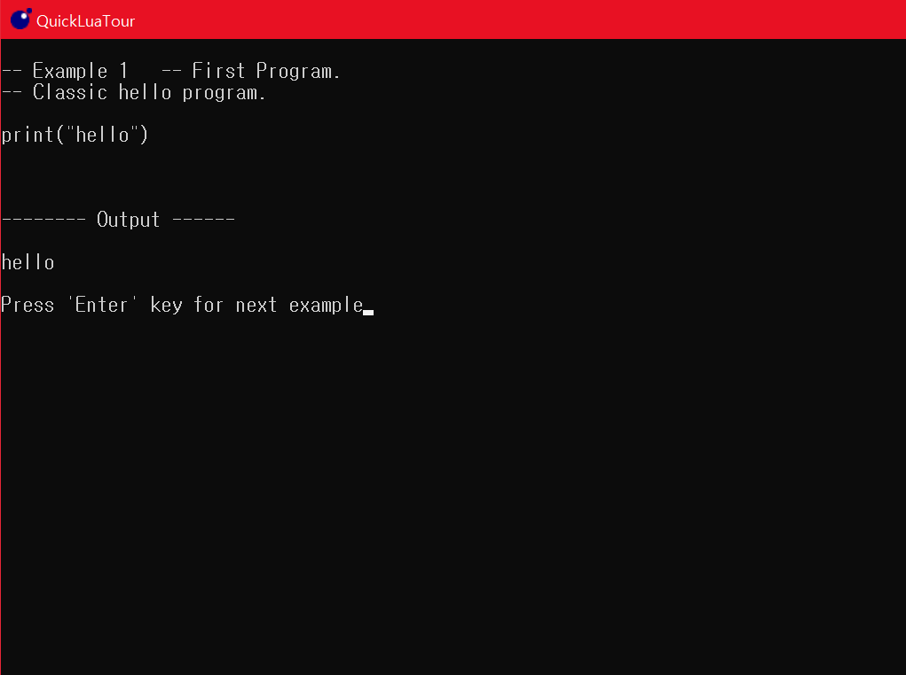

## Lua

[Lua_Web](http://www.lua.org)

1. 1993년 개발된 프로그래밍 언어.
2. 명령형/절차적 언어 이며, 인터프리터방식. 함수형 언어
3. 인터 프리터 방식은 한 블럭 단위로 해석한 다음 처리하므로, 결과를 즉시 할수 있다.
   그러나, 매번 번역을 해서 실행하므로 프로그램 전체의 실행 시간은 컴파일러 방식보다 느리다.
4. OOP에 최적화된 함수 및 코드 구조
5. 멀티스레딩 지원
6. 연관 배열 제공
7. GC를 통항 메모리 문제 해결
8. fallback Mechanism 
-> 웹앱을 만들때 브라우저에 따라 지원 기능이 달라 의도한 기능이 지원 안될때를 대비, 유사하게 동작하도록 만드는 방법.


### 다운로드

[패키지형태](https://code.google.com/archive/p/luaforwindows/downloads)

루아의 기본 에디터 및 루아의 유용한 유틸리티 포함.

설치후에 QuickLuaTour 를 통해 간단한 예제들을 볼수 있다.




> 1. Hello World

콜론을 써도 되지만 보통 쓰지 않는다.

```lua
print("Hello World!")
print("Hello World!");
```

> 2. 주석 처리

```lua
-- 한줄주석
--[[여러줄
주석]]
```

> 3. 변수

1. 변수명 생성은 `영문` 혹은 `_` 로 시작 숫자는 안된다.

2. `예약어`를 변수 명으로 사용할 수 없다.

3. `동적 변수형`을 지원한다. 즉, 자료형을 선언하지 않고 값에 따라 자동으로 설정된다.

4. null = nil , boolean 타입은 true, false 로만 표시, 

5. `type()` 함수 실행시, 설정된 자료형을 볼수 있다.

6. Table 은 단 하나 뿐인 루아의 자료 구조로, 배열형태, 혹은 키값을 준다.

6. Index 는 0이 아닌 `1`부터 시작한다.
 
```lua
Lua 5.1.4  Copyright (C) 1994-2008 Lua.org, PUC-Rio
> a = 10
> b = "Lua"
> _print = print
> d = true
> f = {1,2,3,4}
> f["num"] = 365

> print(type(a))
> print(type(b))
> print(type(c))
> print(type(print))
> print(type(d))
> print(type(f))
number
string
nil
function
boolean
table

> print(f)
table: 00840168
> print(f[0])
nil
> print(f[1]) -- 인덱스는 1 부터
1
> print(f["num"]) -- 문자열로 된 키값 선언 가능
365
> print(f.num) --문자열로 되어있는 키값은 레코드로 접근가능
365

> 1a = a
stdin:1: malformed number near '1a' -- 변수명은 숫자로 시작할수 없음
```

> 3.1 전역변수와 지역 변수

루아는 기본적으로 `전역변수`로 정의되고, `지역변수` 정의를 위해서는 변수명 앞에 local 을 붙인다.