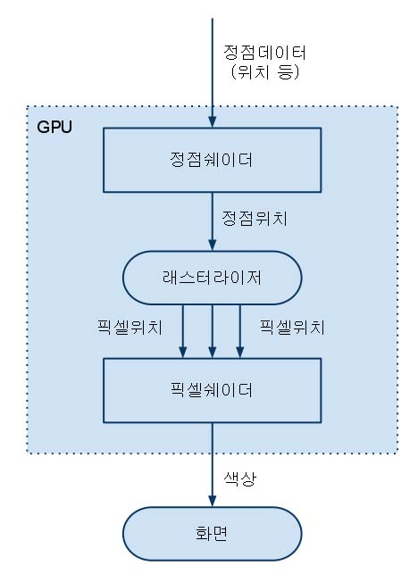

# TIL   / 2018 -05-09
  ## Unity
    ### DirectX 와 Unity3D < C# >

1.   PixelShader(픽셀쉐이더) 와 VertexShader(정점 쉐이더)에 대해 + 파이프라인
2.  4x4 Matrix(행렬) 과 CONST BUFFER (상수버퍼)
3.  빛의종류 와 빛의 속성

+ 참고 (https://kblog.popekim.com/2011/12/02-part-1.html)

## 3D 이론 + DirectX

### PixelShader & Vertex Shader
> 쉐이더란 화면에 출력할 픽셀의 위치와 색상을 계산하는 함수
 픽셀쉐이더란 픽셀의 농담, 색조, 명암을 결정한다.(RGBA값)
 정점쉐이더는 정점들의 위치를 좌표로 변환, 공간변환해준다.

-  3D_PipeLine


1.  3D 모델은 폴리곤(다각형) 으로 구성하는것이 표준, 삼각형들의 집합으로 여러가지 도형들을 나타낸다.
2. 삼각형은 3개의 정점으로 이루어짐 (Vertex, 꼭짓점)
3.  VertexShader는 정점들의 위치를 좌표로 변환하는 것이며, 모든 정점을 <공간변환> 하는것이며  정점의 수만큼 실행된다.  이 VertexData 들을 3개씩 그룹지으면 삼각형을 만들수있다. (시계방향으로 그려줌)
 4. 화면을 구성하는것은 많은 수의 Pixel이며, 이 Pixel을 어디에 몇개나 그려야 하는지를 Rasterizer(래스터라이저) 가 해준다.
5. 래스터라이저가 만든 삼각형에 PixelShader 가 화면에 출력할 최종 색상을 계산하는 것임.

+ <공간변환>  
1. 한 물체의 중심을 원점으로 삼고, 시작으로 직교하는 벡터를 만듬,
원점 부터 물체의 표면까지의 거리를 재면 x,y,z (벡터) 가 나옴  = Local Space
2. 한 공간을 중심을 원점으로 삼고, 벡터를 만들어서 공간안의 물체들의 벡터 까지 거리를 잼
= World Space
3. 카메라 렌즈의 중앙을 원점으로 삼고,  벡터를 만듬.
카메라의 위치에 따라 여러물체들이 보이거나 보이지않음, = View Space
4. 사람의 눈과 같이 카메라의 화각에 따라, 멀리바라볼수록 물체를 바라보는 범위가 넓어지고, 크기가 작아짐,  = Orthogonal Projection
5. 정점의 위치벡터에 공간 행렬을 곱한다.
6.
물체공간 ----------> 월드공간 --------> 뷰공간 ---------> 투영공간
              ⅹ월드행렬                   ⅹ뷰행렬                ⅹ투영행렬


### float4 & float4x4 (Matrix, 행렬)
> Expain shortly

-  float4: 4개의 성분을 가지는 벡터 데이터형
- float4x4: 4 X 4 행렬 데이터형
- mul(): 곱하기 함수. 거의 모든 데이터형을 변수로 받음.
- POSITION: 정점위치 시맨틱. 정점데이터 중 위치정보만을 불러옴.

- float4 는 (X, Y, Z, W) 를 가지는 벡터,


```
// 정점데이터에서 위치정보를(POSITION) 을 mPosition 에 대입
struct VS_INPUT
{
    float4 mPosition : POSITION;
};

// 위에 월드행렬, 뷰행렬, 투영행렬은 각 정점마다 값이 변하지않으니, 전역변수로 선언해서 사용
float4x4 gWorldMatrix;
float4x4 gViewMatrix;
float4x4 gProjectionMatrix;
```

+ 이론적인 부분 (DirectX)
다이렉트 X에서 카메라와 카메라의 일정 화각이 있고, 오브젝트가 있다고 하자.
유니티의 경우 오브젝트의 오더레이어에 따라서 보이는 순서가 결정되지만
다이렉트 X는 일일히 설정  해줘야한다.
그렇지 않으면 기본값으로 제일 뒤에있는 오브젝트 부터 그려진다.

이를 Z-buffer , 혹은 depth-buffer 라고 한다.

UI의 경우 Z버퍼를 끄고 세팅, 오브젝트의 경우 Z버퍼를 켜고 설정해줘야 오브젝트가 UI를 가리는 경우가 생기지 않는다.

즉 여러가지 오브젝트들이 겹치는 경우가 있기에 그에따라 Z-buffer 를 켜거나 꺼줘야한다,.
+ 이동행렬, 크기행렬, 회전행렬

## 빛

### 빛의 종류
> 빛의 종류에는 Ambient Light , Directional Light, Point LIght, Spot Light 가 있다.

- 물체를 밝히기 위해서는 빛이있다. 빛도 있으면 그림자도있다.
- 유니티에서는 이 명암을 계산하기 위해서, 빛의 강도, 방향, 색의 정보가 필요하다.

1. 동적조명 (RealTime Lighting)
  - Directional, Spot ,Point Lighting 을 매프레임 실시간 업데이트.
  - 가장 기본적인 방법으로 움직이는 사물을 비추는데 적합
  - 이 동적 조명에서 방출한 빛은 일단 방출되면 반사되지않으며, 좀 더 사실적인 빛의 표현을 위해서는 전역조명(Global Illumination) 등의 기법을 사용

2. 베이크드 라이트 (Pre-Computed Lighting)   
  - light map = 조명과 그림자의 실시간 연산에 따른 비용를 줄이기 위해서 미리 조명과 그림자연산이 계산되어있는 2D 텍스쳐를 만들어 입히거나, 참조용 텍스쳐맵에 보존
  - 정적인 오브젝트의 광원을 계산하여, Scene 속 지오메트리 상에 텍스쳐로서 오버라이드됨.
  - Static 의 속성이므로 게임플레이중에 변경이 불가하다.
  - Normal Map 참고

- 빛의 종류

1. 주변광(환경, Ambient Light) - 예를 들어 태양빛을 받았을때 그림자가 완전히 어둡지 않다. 이를 산란이나 분산에 따라 빛이 그림자에 생기는 것인데, 이름 통틀어서 주변광이라고 한다.

-  연산이 거의 없지만 명암이 없기에 단조로워 보인다.
- 한마디로 아무리 광원이 없어도 빛이 존재하는것.

2. 직사광  - Directional Light

- 위치는 존재하지않고 방향만 존재하는 빛.  즉, 어느 위치에서라도 일정한 방향을 가지는 빛. 태양.
- 이 방향을 받은 존재(빛을 받은 오브젝트)만 연산을 한다.

3. Point Light - 횟불이나 전구같은것.
- 위치는 있지만 방향은 존재하지않는것.
- 사방으로 퍼져나가는 빛, 그래서 연산이 조금 더 느림.
- 즉, 감쇄가 이루어져서 느리기 때문인데 세가지 정도의 감쇄의 효과가 있다.

+ 감쇄 효과에 대해 추가할것.

4. Spot Light
- 비용을 많이 먹어서 거의 안쓴다.
- 방향 위치 모두 존재함.
- 예를 들어 손전등 처럼 광원 가운데는 빛이 세고,  주변은 약한것이며, 멀어지면 감쇄한다
-  각도에 따라 빛이 받는 양이 다름. 그렇기 때문에 인게임에서 플래쉬 효과를 낼때에는 이미지를 넣고 블렌드 효과를 준다.

5. 자체발광.
태양과 같은것.


### 빛의 속성

1. Difuse = 빛의 색상
Amibient 가 포함됨.( 빛이 받지않는 곳은 무슨색상으로 할것인지)

2. Specular = 제일 밝게 반사되는 반사광이 무슨색상인지.

- 각 물체들은 Meterial 이 있고, Meterial 에 따라서 반사가 달라짐.
- 빛이 많아질수록 느려짐


###Texture,
+ 추가할것.
vertex+RGB * UV
UV == XY,
UV좌표를 입력해서 원하는곳의 텍스쳐를 입힐수있다.
