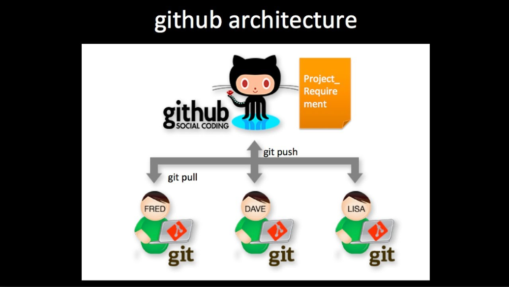
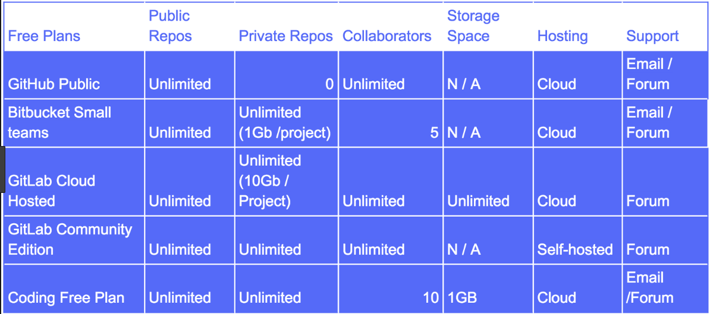
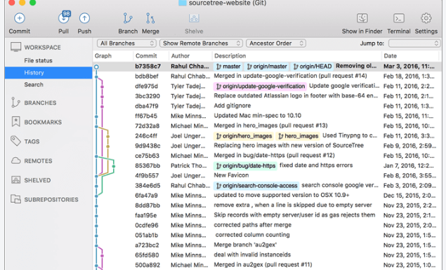
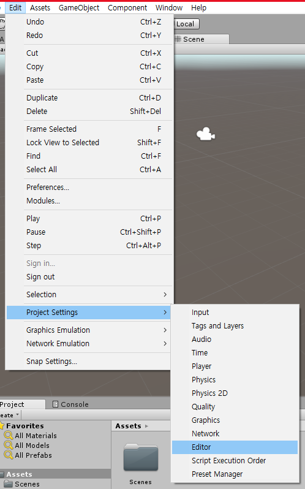
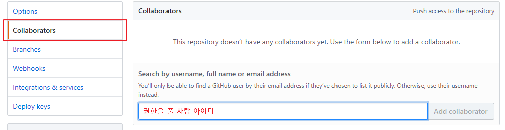
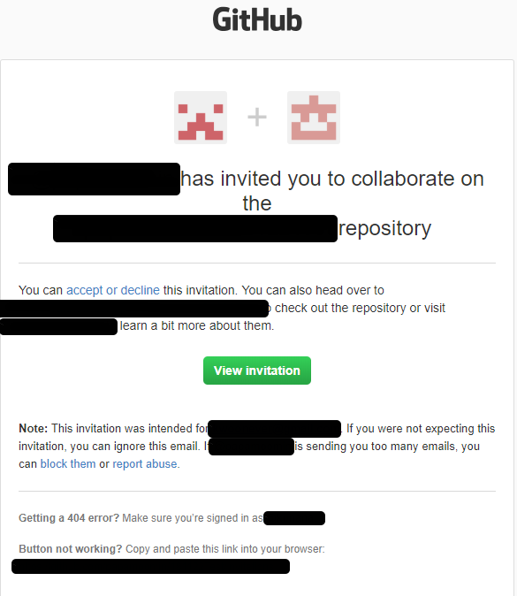
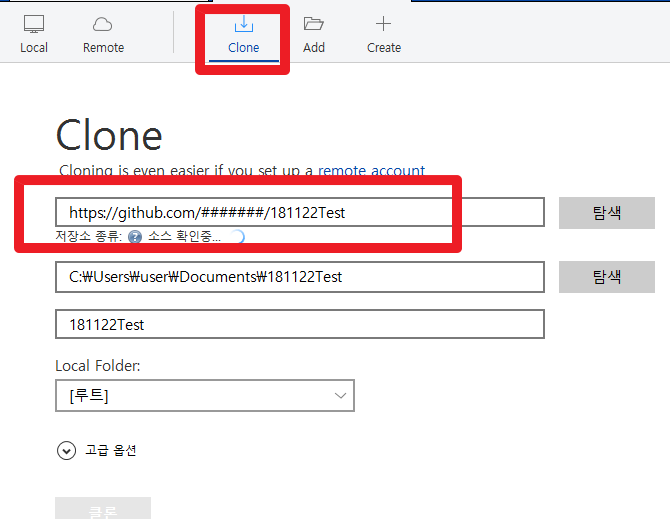
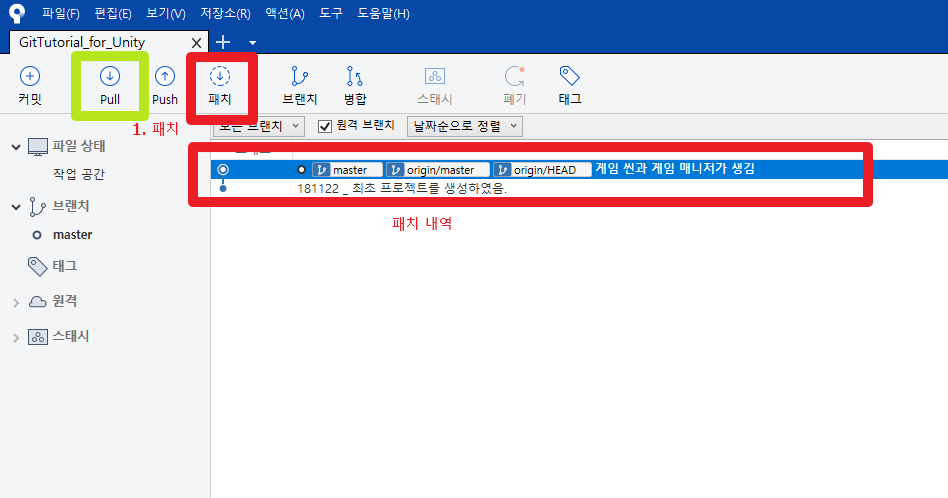

# TIL   / 2018 - 10 - 27

```
GIT
소스 코드 관리를 위한 분산 버전 관리 시스템
```

>### Git 호스팅 웹서비스


[출처](https://medium.com/flow-ci/github-vs-bitbucket-vs-gitlab-vs-coding-7cf2b43888a1)

1. GitHub

private 은 유료. LFS트래픽 제한
Large File Storage

2. Bitbucket

리포지터리당 1GB , private 무료(5인까지)

3. GitLab

private 무료 (협업자수 제한 없음)
리포지터리당 10GB 빌드머신 구현에 용의
설치형, 호스팅형 두가지.
가끔씩 불안정함(``6시간 데이터 유실 사건!``)

##### 나의 git 랭킹은?  http://git-awards.com/

> ### Source Tree


+ 로컬에서 git 을 편리하게 사용할 수 있도록 만들어진 유틸리티

+ BitBucket 계정 필요

> #### 따라해보자!

1. 새로운 유니티 프로젝트 CalcGame 생성
2. git 기본 설정 (IgnoreFile, Unity git 사용 설정, 구글 에서 unity Project Settings git 검색)
4. github 에서 새로운 리포지터리 CalcGame 생성
5. 소스트리를 이용하여 Calc Game 로컬 리포지터리 생성
6. 소스 트리를 로컬리포지터리와 git 리포지터리 연결
7. 
8.  


> #### 유니티 프로젝트 설정하기!

1. Edit -> ProjectSettings -> Editor 를 선택


    1.1 Version control 
    VCS 을 설정하거나 Unity 에서 .meta 파일을 사용해 데이터를 저장하는 크게 두가지로 나뉜다. __Unity Personal 에서는 VCS 를 설정하는 것은 사용할 수 없다.__ 
    .meta 파일을 숨김파일로 지정하느냐 일반 파일로 지정하느냐의 차이인데 Git 에서는 숨김 파일은 취급하지 않기 때문에 Visible Meta Files 옵션을 사용한다.
    1.2 Asset Serialization 
    Unity 프로젝트에서 Unity 에서 직접 지정하는 확장자가 붙은 파일들을 어떻게 취급하냐를 설정하는 옵션이다. Unity 프로젝트에서는 두가지 방식으로 파일을 취급할 수 있는데 하나는 텍스트 형식으로 취급하는 것과 하나는 바이너리 형식으로 취급하는 것이다. 옵션의 선택지를 보면 총 3가지 인데 맨처음 Mixed 는 Unity 에서 파일마다 지정한 방식대로 텍스트냐 바이너리냐를 따라가는 것이고 나머지 두개(Force Text, Force Binary)는 무조건 한가지 방식으로 모든 파일들을 통일하는 것이다. 여러 용도로 텍스트를 사용하므로 Force Text 옵션을 사용한다.

> #### .gitignore 설정.

유니티에서 라이브러리 디렉토리는 프로젝트의 캐시 데이터 이므로, 굳이 없어도 다시끔 만들어 지게 된다. 


> #### Project 클론을 위한 권한 할당해주기
> 

아이디를 입력해주면 해당 아이디의 메일에 메일이 오면 수락후, 



클론!



이제 두명이서 한개의 유니티 프로젝트를 작업할수 있게되었다.

만약 작업자 A 가 작업을 하고 커밋을 하였을때, 패치 버튼을 누른다면, 리포지토리에서 받지않는 새로운 내역이 뜬다.

Pull을 눌러서 유니티 프로젝트를 업데이트 시켜주자.



> #### Conflict 가 생겼을 경우

> #### Branch 와 Git flow, Check out, Tag

##### Branch?
+ 한번에 해야하는 작업이 너무 클때
+ 쪼개서 commit 해서 프로젝트가 작동되지 않아 다른개발자가 곤란해진다면?


##### Git Flow?
[출처](https://lucamezzalira.com/2014/03/10/git-flow-vs-github-flow/)
.png)
브랜치를 dev, release, master, hotfix 로 나눠서, 개발용, 정식배포용, 핫픽스용으로 나누다가 개발 완료 되면 master 로 보내서 커밋, 머지 후 배포 하는식.

+ check out (특정시점으로이동, 다른 브랜치로 이동)

현재 작업하던 브랜치를 바꾸거나, 현재 브랜치내에서 특정 커밋 시점으로 이동 하고 싶을때.

이때 수정한후 커밋하면 임시로 HEAD 브랜치가 생기는데 이 브랜치는 임시 브랜치이므로, 다시 새로운 브랜치로 체크아웃 하기전에  새로운 브랜치를 만들어서 작업한 내용이 날아나지않게 주의.

+ rebase(이쁘게 머지하기)

+ revert(커밋삭제, 기록남김, 푸쉬후,)

이미 push 한 상태라면 내가 푸쉬했던 내용을 되돌리고, 기록을 남김

+ statsh(보관)

작업내용을 커밋하기 전에 잠깐 보관할때 사용.

예를 들어 내가 릴리즈 브랜치에서 작업 중인데, 다른 브랜치로 옮겨야 되는데, 작업내용을 옮기기 애매하거나, 다른 브랜치에서는 오류가 날것 같을때, 임시로 커밋을 보관 해둔다.

혹은..
다음 버전의 신규 기능을 개발하고 있는데, 며칠 전 배포한 버전의 기능에서 문제가 생겨서, 긴급히 수정해야하는 상황.
코딩을 한참 했는데, 커밋을 하려고 보니 master 브랜치인 상황.

+ reset(커밋삭제, 기록안남김, 푸쉬전)

자신의 변경 내역을 지우고 파일을 마지막으로 커밋한 상태로 되돌린다. 신규 아이템에는
리셋이 아닌 삭제가 진행된다. AssetServer에서는 discard.

변경된 작업내용은 로컬이니까 남아있지만, 커밋은 취소됨

1.1 커밋 내용의 Reset 과 작업내용의 Reset도 구분할것.

+ Cherry Pick
  
다른 브랜치의 특정 커밋만 불러오고 싶을때 사용

+ Tag 

> #### 유니티로 다수의 인원이 개발할때 팁

출처: http://tsubakit1.hateblo.jp/entry/20140613/1402670011
번역: 이근수, Assistant Producer, Maverick Games

필독 할 [문서](https://docs.google.com/document/d/1ZPwEBlx9DY4GCmjVWu5We4juZOpRf4Nb70GNcCbz-pM/preview#heading=h.m26o5sf6u87b)


> #### Sub Module

깃 리포지터리 아래의 다른 하위 깃 리포지터리를 관리하기 위한 도구이다.
나의 깃 repository 안에 다른 repository 를 포함시키는것.
예를 들어 나만의 라이브러리 리포지토리를 새로운 프로젝트 리포지토리에 포함시켜서 사용해도 될듯.

> #### 좋은 커밋 메세지를 작성하기위한 7가지
좋은 git 커밋 메시지를 작성하기 위한 7가지 약속
이하 약속은 커밋 메시지를 English로 작성하는 경우에 최적화되어 있습니다. 한글 커밋 메시지를 작성하는 경우에는 더 유연하게 적용하셔도 좋을 것 같네요.

1. 제목과 본문을 한 줄 띄워 분리하기
2. 제목은 영문 기준 50자 이내로
3. 제목 첫글자를 대문자로
4. 제목 끝에 . 금지
5. 제목은 명령조로
6. 본문은 영문 기준 72자마다 줄 바꾸기
7. 본문은 어떻게보다 무엇을, 왜에 맞춰 작성하기